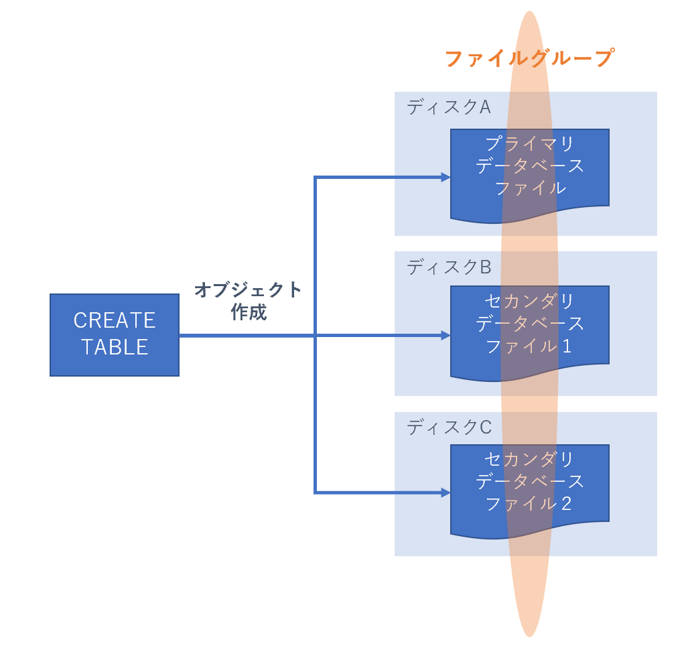

# ON [PRIMARY]とは？

CREATE TABLEする時にON [PRMARY]句が添えられることがある。  
どういった意味があるのか気になったのでまとめ。  

``` sql
CREATE TABLE [dbo].[TableName](
    [columnA] [int] NULL,
    [columnB] [nvarchar](50) NULL,
    ・・・
) ON [PRIMARY]
```

- SQL Serverでデータベースを作成する際、複数のファイルグループを構成することができる  
- それぞれのファイルグループには名前がついていて、”PRIMARY”は規定の名前  
- `ON [PRIMARY]`がついている場合は、SQL Serverで規定で作成される”PRIMARY”という名前のファイルグループにテーブルが作成されることになる  

---

## ファイルグループとは？

データベースの情報はデータベースファイルという実体の中に格納されている。  
データベースファイルには、3種類存在する。  

- プライマリ：  
  データベースの起動情報や、データとオブジェクトなどが含まれる。  
- セカンダリ：  
  省略可能なユーザ定義データファイル。  
  複数のセカンダリデータベースファイルをそれぞれ異なるディスクに配置することでデータをディスク間で分散できる。  
- トランザクションログ：  
  データベースの復旧に使用するトランザクションのログ。  

ファイルグループとは、これをグループ化したもので、このファイルグループを指定してCREATE TABLEなどのT-SQLを投げると、ファイルグループ内のデータファイルにオブジェクトが作成される。  
つまるところ、冗長化を実現できるものらしい。  

  

---

[SQL ServerのON [PRIMARY]句って何を意味してるの？ファイルグループの概念も解説 | 煎茶](https://www.simpletraveler.jp/2022/04/09/sql-server%E3%81%AEon-primary%E5%8F%A5%E3%81%A3%E3%81%A6%E4%BD%95%E3%82%92%E6%84%8F%E5%91%B3%E3%81%97%E3%81%A6%E3%82%8B%E3%81%AE%EF%BC%9F%E3%83%95%E3%82%A1%E3%82%A4%E3%83%AB%E3%82%B0%E3%83%AB/)  
