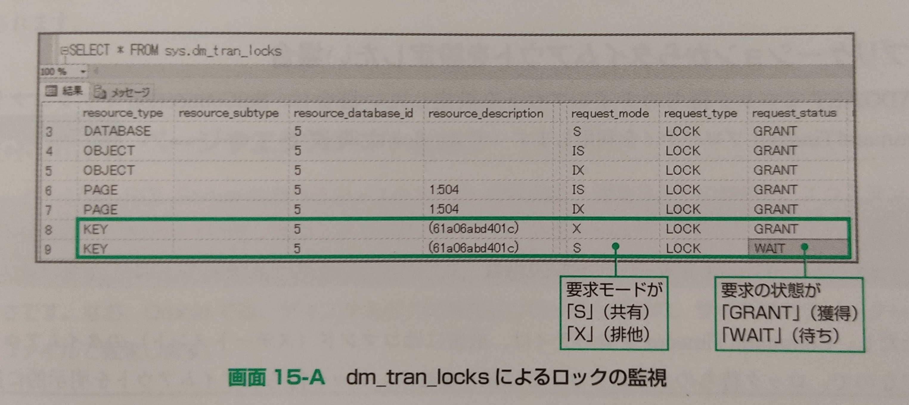

# ロック

---

## 概要

複数のトランザクションによる同時更新を防ぐための機能がロック(Lock)。  
データを更新している時に、他のトランザクションから同時に更新されないようにデータをブロックする機能。  

ロックを利用することで、データを正確に保つことができるが、アプリケーションの同時実行性(パフォーマンス)には悪影響を及ぼす。  
ロックの実装はデータベース製品によって異なる。  
特にSQLServerはOracleとは実装が大きく異なる。  

トランザクションとは切っても切れない。  
SQLServerでは次の2つをトランザクションとして扱う。  

- UPDATE/INSERT/DELETE などの更新系のステートメント  
- BEGIN TRANSACTION から COMMIT TRANSACTION で挟まれた複数のステートメント  

---

## ロックの種類

「排他ロック」と「共有ロック」の2種類がある。  

### 排他ロック(eXclusive)

あるトランザクションが実行している更新系のステートメント(UPDATE/INSERT/DELETE)によるデータ更新に対して、他のトランザクションから一切アクセスできないように排他制御を行うロック。  
これにより、同じデータが同時に更新されることを防ぐ。  

※排他は「占有」「独り占め」という意味。  
従って、排他ロックは「占有ロック」「Write(書き込み)ロック」と呼ばれることがある。  

### 共有ロック(Shared)

あるトランザクションが実行している検索(SELECTステートメント等の読み取り操作)に対して、他のトランザクションから更新できないようにするロック。  
共有ロックでは、他のトランザクションが検索することはできる。  
検索しているデータは他のトランザクションから検索されても、データに矛盾が発生することはないため。  

共有ロック同士は、共存(両立)できることから共有ロックとも呼ばれる。  
検索時にかけるロックであることから「Read(読み取り)ロック」と呼ばれることもある。  

### 早見表

| | 共有ロック | 排他ロック |
| :-: | :-: | :-: |
|共有ロック | ○ | × |
|排他ロック | × | × |

---

## ロックの保持期間

| | 保持期間 |
| :-: | :-- |
|排他ロック | トランザクションが完了するまで |
|共有ロック | 読み取りが完了するまで |

排他ロックはトランザクションが完了するまで保持されるが、共有ロックは読み取り操作が完了するとすぐに解放される。  

---

## SSMSからロック状況の確認

`利用状況モニター`ツールを利用する。  

  

[タスクの状態]が[SUSPENDED]、[待機の種類]が[LCK_M_S]、[待機リソース]が[keylock~]となっているものが、SELECTステートメントに寄る共有ロック(LCK_M_S : Lock Mode Shared)が排他ロックによって待ち状態(SUSPENDED)になっているプロセス。  

---

## SQLステートメントでロック状況の監視

ロックの状況は`dm_tran_locks`というビューを利用して、SQLステートメントから監視することも可能。  

``` sql
SELECT * FROM sys.dm_tran_locks
```

  

request_mode : 要求モード  
[S] : 共有  
[X] : 排他  

request_status : 要求の状態  
[GRANT] : 獲得  
[WAIT] : 待ち  

※SQLServer 2000 を利用している場合は`sp_lock`  

``` sql
sp_lock
```

`sp_lock`は下位互換性のため2016でも提供されていて、同じように利用することができるが、将来的に削除される予定であるため、素直に`dm_tran_locks`を使うべし。  

---

## ロック状態を確認するクエリ

``` sql
SELECT
     resource_type AS type --オブジェクトの種類
    ,resource_associated_entity_id as entity_id  --エンティティID
    ,( CASE WHEN resource_type = 'OBJECT' THEN
          OBJECT_NAME( resource_associated_entity_id )
      ELSE
          ( SELECT
              OBJECT_NAME( OBJECT_ID )
           FROM
             sys.partitions
           WHERE
               hobt_id=resource_associated_entity_id )
      END)
        AS object_name
    ,request_mode --ロックの種類
    ,request_type --要求の種類
    ,request_status  --状態
    ,request_session_id AS Session_id --セッションID
        ,(SELECT hostname 
          FROM sys.sysprocesses 
          WHERE spid = request_session_id) AS ProcessName
FROM
    sys.dm_tran_locks
WHERE
    resource_type <> 'DATABASE'
ORDER BY
    request_session_id
```

[SQLServerのテーブルロック状態を取得するSQL](https://www.excellence-blog.com/2016/11/11/sqlserver%E3%81%AE%E3%83%86%E3%83%BC%E3%83%96%E3%83%AB%E3%83%AD%E3%83%83%E3%82%AF%E7%8A%B6%E6%85%8B%E3%82%92%E5%8F%96%E5%BE%97%E3%81%99%E3%82%8Bsql/)  

---

## ロックを解消する

ロック状態を確認するクエリでセッションIDを調べる。  
ロックを解除したいセッションIDに対してKILL命令を実行する。  

``` sql
KILL '<セッションID>'
```

セッションID 64 を強制終了する場合  

``` sql
KILL 64
```

[SQL Serverでセッションを強制終了(KILL)する](https://fumokmm.github.io/it/sqlserver/kill_a_session)  

---

## ロック待ちのタイムアウト

SETステートメントを実行することで設定可能。  

``` sql
SET LOCK_TIMEOUT タイムアウトまでの時間
```

時間はミリ秒単位指定。  
デフォルトは無制限に待ち続ける状態。  

5秒なら[5000]と指定する。  
一切待たないようにするには「0」と指定する。  
デフォルトへ戻す場合は[-1]を指定する。  

この設定は接続が切れるまで有効。  

---

## ロックの粒度

ロックをかける大きさの単位をロックの粒度と言う。
粒度が小さければ、同時に実行できるトランザクション数が増える。  
**SQLServerでは、基本的には行ロックが使用される。**  

| 粒度 | 説明 |
| :-- | :-- |
| 行(RID) | 行ロック。RIDはROW ID(行識別子)の略 |
| キー(Key) | インデックス内の行ロック |
| ページ(RAG) | 8KBの大きさ |
| エクステント(EXT) | 連続した8ページ(64KB |
| テーブル(TAB) | テーブル全体 |
| データベース(DB) | データベース全体 |

粒度の大きさはステートメントの内容によって変化する。  
具体的には、取得するデータが大量の場合(例えば100万件のうち90万件を取得する場合など)には、ページやテーブル単位のロックが選択される。  
ロックの粒度は**SQLServerが最適だと判断**した大きさのものが自動的に選択される。  
ロックの粒度拡大は**ロックエスカレーション**と呼ばれる。  

### ページやエクステントとは？

ページはSQLServerにおけるディスク入出力(読み取り、書き込み)の単位。  
エクステントは連続した8ページ。  

エクステントはテーブルスキャン時や一括操作時の入出力の単位。  
ページの大きさは8KBに固定であるため、エクステントは64KB(8ページ分)の大きさとなる。  

Oracleでは、ディスク入出力の単位はブロックと呼ばれ、サイズはパラメータファイルで設定する。  

---

## ロックの粒度の明示的な設定

ロックの粒度は明示的に指定することが可能。  
この機能は「ロックヒント」や「オプティマイザーヒント」と呼ばれる。  
ロックヒントを利用することで、SQLServerが選択したロックの粒度をユーザーが強制変更することができる。  

ロックヒントを利用するには、ステートメント内のテーブル名の後ろへ`WITH`句を指定する。  

UPDATEステートメントで行単位のロックを強制する場合

``` sql
UPDATE TableName WITH(ROWLOCK)
SET ... 
WHERE ...
```

SELECTステートメントでテーブル単位のロックを強制する場合

``` sql
SELECT * 
FROM TABLE1 WITH(TABLOCKX)
```

複数テーブルをJOINしている場合は、テーブル毎にロックヒントを指定する必要がある。  

``` sql
SELECT *
FROM Table1 WITH(ロックヒント)
INNER JOIN Table2 WITH(ロックヒント)
ON ...
WHERE ...
```

| 粒度 | ロックヒント |
| :-- | :-- |
| 行(RID) | ROWLOCK |
| キー(Key) | ?? |
| ページ(RAG) | PAGLOCK |
| エクステント(EXT) | ?? |
| テーブル(TAB) | TABLOCK |
| データベース(DB) | ?? |

[ＳＱＬサーバーロック](https://development.station-t.com/SqlServer_Lock.htm)  

---

## TABLOCK

テーブルにロックを使用し、ステートメント終了まで保持することを指定します。  
データの読み取り中は、共有ロックが使用されます。  
データの変更中は、排他ロックが使用されます。  
HOLDLOCK も指定してある場合は、共有テーブル ロックがトランザクション終了まで保持されます。  

インデックスのないテーブルにデータをインポートするため、OPENROWSET 一括行セット プロバイダで TABLOCK を使用すると、対象テーブルへのデータ読み込みを、ログ記録とロックとを最適化して、複数のクライアントで同時に行うことができます。  

---

## TABLOCKX

トランザクションが完了するまでテーブルに排他ロックを使用することを指定します。  
(TABLOCKX)は(TABLOCK, XLOCK)でも同じようだが、後者を使用するとデッドロックになるらしい  

---

## UPDLOCK

更新ロックを使用することと、これをトランザクション終了まで保持することを指定します。  

---

## XLOCK

排他ロックを使用することと、これをトランザクション終了まで保持することを指定します。  
ROWLOCK、PAGLOCK、または TABLOCK と組み合わせて指定すると、排他ロックは適切な粒度レベルに適用されます。  
