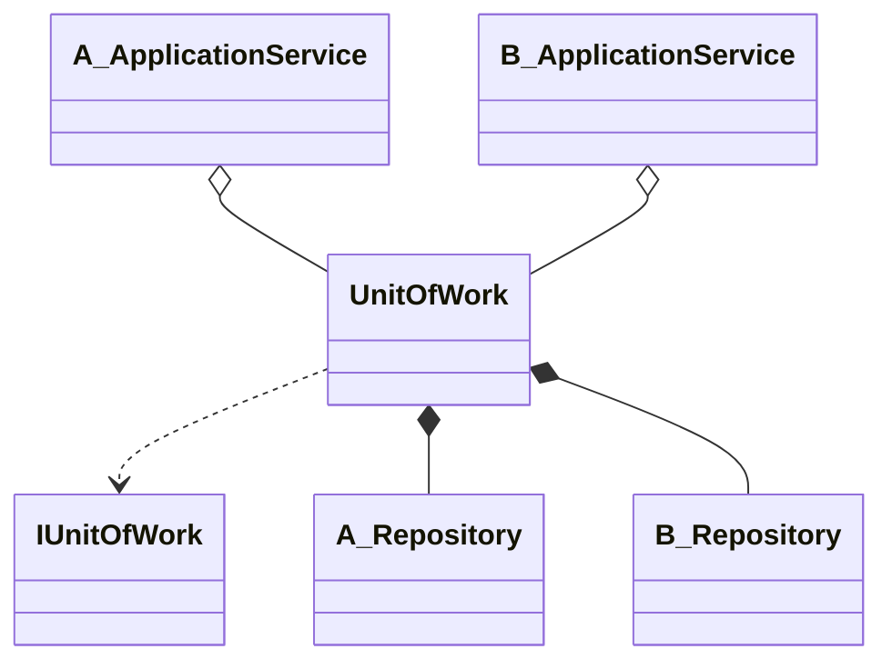

# Unit Of Work

---

## 概要

>ユニットオブワークはあるオブジェクトの変更を記録するオブジェクトです。  
ユニットオブワークはオブジェクトの読み取り動作を行う際にインスタンスの状態を記録します。  
読み取られたオブジェクトの変更や削除はユニットオブワークに通知しない限りデータストアへ反映されることはありません。  
コミット処理が呼び出されると、そこまでの変更処理をデータストアに対して適用します。  
このパターンを適用すると、永続化の対象となるオブジェクトの作成・変更・削除といった動作はすべてユニットオブワークを通じて行うようになります。  
[成瀬 允宣. ドメイン駆動設計入門 ボトムアップでわかる！ドメイン駆動設計の基本 (pp.360-361). 株式会社翔泳社. Kindle 版]  

<!--  -->
>Unit of Work は、データベースに対して実施しなければならない操作 (一般には CRUD ということになります) を維持していくパターンです。  
DB に対する変更の必要が生じる都度 INSERT/DELETE/UPDATE なんかを実行していくとパフォーマンス影響が生じますし、トランザクションがクライアントサイドからの複数のリクエストに跨るのを制御するのは難しいため、これらを解決するパターンとして登場しました。  
Unit Of Work では、業務トランザクションにおいて実行すべき DB 操作を維持し、業務トランザクション完了時点でそれを DB に commit します。  
[理系学生日記](https://kiririmode.hatenablog.jp/entry/20161204/1480827355)  

---

## UnitOfWorkのパターン

検索した例では、UnitOfWorkの実装にリポジトリを保持しているモノが大半だが、これもあくまで1つのパターンであって、他にもある模様。  

>また、ユニットオブワークにリポジトリを保持させて、リポジトリ自身に変更の追跡を行わせるパターンもあります。  
>[@成瀬 允宣. ドメイン駆動設計入門 ボトムアップでわかる！ドメイン駆動設計の基本 (p.365). 株式会社翔泳社. Kindle 版.]  

---

## TransactionScopeとの違い

1つの処理としてまとめるパターンだとして、トランザクションスコープと何が違うのか？  
それ自体がトランザクションという事にならないのだろうか？  

同じような疑問を持つ人はいるのだが、ズバリといった回答が全くない。  
なぜなのか。  

強いて言えば、TransactionScopeで囲む必要がないのと、TransactionScopeという仕組みがない言語でも、トランザクションの範囲を定義する事ができる点で違うのだろうか。  
そのためのUnitOfWorkという

>この2つは全く別のものです。Unit of Workはデザインパターン、またはソフトウェアの問題を解決する方法のガイドラインのセットです。TransactionScopeは、トランザクションのスコープをプログラムで定義するために使うクラスです。  
[What is the difference between TransactionScope and Unit of work in Entity Framework](https://stackoverflow.com/questions/33826747/what-is-the-difference-between-transactionscope-and-unit-of-work-in-entity-frame)  

<!--  -->
>Unit Of Workはもともと、1つのコマンドで複数の集約に対してロジックを実行できるようにするために導入されたものです。  
もし集約がトランザクションの範囲であれば（CQRSによるとそうなっている）、ここでは実際に複数のリクエストについて話していることになる。  
トランザクションといえば、主にデータベースへの変更が行われる基礎となるデータベーストランザクションを意味します。  
しかし、これは完全に任意である。  
たとえば、ユニットがすべての更新をデータベースに書き込もうとする場合、基礎となるデータベーストランザクションを使用することができます。  

Unit Of Workは現在、リポジトリによってロードされたアグリゲートを追跡し、UnitOfWorkがコミットされたときにそれらを永続化します。Martinによると、私が正しく理解していれば、それこそがUoWが行うべきことです。
マーティン・ファウラー「データベースにデータを出し入れするとき、何を変更したかを追跡することが重要です。そうしないと、そのデータはデータベースに書き戻されませんから。[中略）作業単位は、データベースに影響を与える可能性のあるビジネストランザクション中のすべての作業を記録しています。作業終了後、作業の結果としてデータベースを変更するために必要なことをすべて把握することができます。"

---

## EntityFramework

EntityFrameworkはRepositoryPatterもUnitOfWorkPatternも実装している。  
DBContextはユニットオブワークの実装となる。  
このリンク[ボトムアップドメイン駆動設計 後編](https://nrslib.com/bottomup-ddd-2/#outline__3_5)で紹介されている、UnitOfWorkの実装に対する既視感はEFのDbContextだと紹介されている。  
以下のコードがそれである。  

``` cs
public class SampleDContext : DbContext {
    public DbSet<User> Users { get; set; }
}
```

このリンクでも紹介されているが、`DbContext`を継承したクラスが`UnitOfWork`にあたり、`Set<T>`の部分が`Repository`に当たるので、改めて実装する必要はない。  
[No need for repositories and unit of work with Entity Framework Core](https://gunnarpeipman.com/ef-core-repository-unit-of-work/)  

このリンク[Is unit of work pattern really needed with repository pattern](https://softwareengineering.stackexchange.com/questions/406729/is-unit-of-work-pattern-really-needed-with-repository-pattern)では、このめっちゃ参考になる動画[Repository Pattern with C# and Entity Framework, Done Right | Mosh](https://www.youtube.com/watch?v=rtXpYpZdOzM)について言及しているが、わざわざUnitOfWorkを再実装してこのように記述する意味がわからないと言っている。  

```cs
using(var UnitOfWork = new UnitOfWork(new DBContext()))
{
    UnitOfWork.Courses.Get(1);
}
```

dbContextではこのように書けるのに、だ。  

``` cs
using(var dbContext = new DBContext())
{
    var courseRepo = new CourseRepo(dbContext);
    var otherRepo = new OtherRepo(dbContext);
    courseRepo.Get(1);
}
```

UOWの作成は、抽象化の抽象化。  

>Entity FrameworkのDbContextはUnitOfWorkであり、そのDbSet\<T>プロパティはリポジトリです。  
>
>リポジトリパターンで作業単位は本当に必要なのか？  
>
>はい、それは複数のリポジトリにまたがるアトミックなデータ操作をオーケストレーションするためです。  
>ユニットオブワークは、オーケストラ（リポジトリ）のディレクター（uow）だと考えてください。  
>
>Entity Frameworkでunit of workパターンは本当に必要なのか？  
>
>必ずしもそうではありません。EFはすでにユニットオブワークパターンを提供しています。  
>まだユニットオブワークを持つ唯一の理由は、次のような場合です。  
>
>- アトミックなデータ操作に非EFデータソースを含めたい。  
>- そのレイヤーのEF依存に依存することなく、あなたのドメインで仕事のユニットを使用したい。  
>- EFが提供するものよりも豊富な機能セットを持つ作業単位が必要な場合。  
>  ただし、これはラップするのではなく、DBコンテキストを拡張することでできる場合もあります。

---

## EFに既にUnitOfWorkが実装されているのにも関わらず、なぜUnitOfWorkを再設計するのか？

>なぜ、save changesメソッドだけを呼び出すDBコンテキストのラッパーを実装しているかというと、いくつかの理由があります。  
>アプリケーション層をLEDフレームワークや外部の関心事で汚染したくないからです。  
>このため、アプリケーション層で高単位ワークインターフェースを使用しています。  
>
>これには二つの利点があります。  
>一つは、ユニットオブワークと一緒にリポジトリパターンを使っているので、リポジトリに加えられた変更をデータベースに永続化するための save changes メソッドをリポジトリが持っていないため、ビジネストランザクションの最後でユニットオブワークの save changes を呼ばざるを得なくなります。  
>unitofwork のインターフェイスを使っているので、ユニットテストを書いている間にそのインターフェイスのモックを簡単に提供することができます。  
>[Why I Use The Unit of Work Pattern With EF Core | Clean Architecture](https://www.youtube.com/watch?v=vN_j1Bs0ALU)  

---

## イメージ


---

## クラス図



---

## 実装

UnitOfWorkの定義

``` cs
public interface IUnitOfWork : IDisposable
{
    IUserRepository UserRepository { get; }
    ICircleRepository CircleRepository { get; }

    void Commit();
    void Rollback();
}

public class UnitOfWork : IUnitOfWork
{
    private readonly IDbConnection connection;
    private readonly IDbTransaction transaction;
    private bool disposed;

    private UserRepository userRepository;
    public IUserRepository UserRepository => userRepository ??= new UserRepository(connection);

    private CircleRepository circleRepository;
    public ICircleRepository CircleRepository => circleRepository ??= new CircleRepository(cconnectionon);


    public UnitOfWork(IDbConnection connection)
    {
        this.connection = connection;
        this.connection.Open();
        this.transaction = this.connection.BeginTransaction();
    }

    ~UnitOfWork()
    {
        dispose(false);
    }


    public void Commit()
    {
        transaction.Commit();
    }

    public void Rollback()
    {
        transaction.Rollback();
    }

    public void Dispose()
    {
        Dispose(true);
        GC.SuppressFinalize(this);
    }

    protected virtual void Dispose(bool disposing)
    {
        if (disposed)
        {
            return;
        }
        if(disposing)
        {
            if (this.transaction != null)
            {
                this.transaction.Dispose();
                this.transaction = null;
            }
            if(this.connection != null)
            {
                this.connection.Dispose();
                this.connection.Dispose();
            }
        }
        disposed = true;
    }
}
```

UserRepositoryの実装

``` cs
public interface IUserRepository {
    User Find(UserId id);
    User Find(UserName name);
    IEnumerable<User> FindAll();
    void Save(User user);
    void Remove(User user);
}

public class UserRepository : IUserRepository
{
    private readonly IDbConnection con;

    public UserRepository(IDbConnection con)
    {
        this.con = con;
    }

    public User Find(UserId id)
    {
        using (var com = con.CreateCommand())
        {
            com.CommandText = "SELECT * FROM t_user WHERE id = @id";
            com.Parameters.Add(new MySqlParameter("@id", id.Value));
            var reader = com.ExecuteReader();
            if (reader.Read())
            {
                var username = reader["username"] as string;
                var firstname = reader["firstname"] as string;
                var familyname = reader["familyname"] as string;
                return new User(
                    id,
                    new UserName(username),
                    new FullName(firstname, familyname)
                );
            }
            else
            {
                return null;
            }
        }
    }

    public User Find(UserName userName)
    {
        using (var com = con.CreateCommand())
        {
            com.CommandText = "SELECT * FROM t_user WHERE username = @username";
            com.Parameters.Add(new MySqlParameter("@username", userName.Value));
            var reader = com.ExecuteReader();
            if (reader.Read())
            {
                var id = reader["id"] as string;
                var firstname = reader["firstname"] as string;
                var familyname = reader["familyname"] as string;

                return new User(
                    new UserId(id),
                    userName,
                    new FullName(firstname, familyname)
                );
            }
            else
            {
                return null;
            }
        }
    }

    public IEnumerable<User> FindAll()
    {
        using (var com = con.CreateCommand())
        {
            com.CommandText = "SELECT * FROM t_user";
            var reader = com.ExecuteReader();
            var results = new List<User>();
            while (reader.Read())
            {
                var id = reader["id"] as string;
                var firstname = reader["firstname"] as string;
                var familyname = reader["familyname"] as string;
                var username = reader["username"] as string;
                var user = new User(
                    new UserId(id),
                    new UserName(username),
                    new FullName(firstname, familyname)
                );
                results.Add(user);
            }
            return results;
        }
    }

    public void Save(User user)
    {
        bool isExist;
        using (var com = con.CreateCommand())
        {
            com.CommandText = "SELECT * FROM t_user WHERE id = @id";
            com.Parameters.Add(new MySqlParameter("@id", user.Id.Value));
            var reader = com.ExecuteReader();
            isExist = reader.Read();
        }

        using (var command = con.CreateCommand())
        {
            command.CommandText = isExist
                ? "UPDATE t_user SET username = @username, firstname = @firstname, familyname = @familyname WHERE id = @id"
                : "INSERT INTO t_user VALUES(@id, @username, @firstname, @familyname)";
            command.Parameters.Add(new MySqlParameter("@id", user.Id.Value));
            command.Parameters.Add(new MySqlParameter("@username", user.UserName.Value));
            command.Parameters.Add(new MySqlParameter("@firstname", user.Name.FirstName));
            command.Parameters.Add(new MySqlParameter("@familyname", user.Name.FamilyName));
            command.ExecuteNonQuery();
        }
    }

    public void Remove(User user)
    {
        using (var command = con.CreateCommand())
        {
            command.CommandText = "DELETE FROM t_user WHERE id = @id";
            command.Parameters.Add(new MySqlParameter("@id", user.Id.Value));
            command.ExecuteNonQuery();
        }
    }
}
```

CircleRepositoryの実装

``` cs
public interface ICircleRepository {
    Circle Find(CircleId id);
    void Save(Circle circle);
}

public class CircleRepository : ICircleRepository
{
    private readonly IDbConnection con;

    public CircleRepository(IDbConnection con)
    {
        this.con = con;
    }

    public Circle Find(CircleId id)
    {
        using (var com = con.CreateCommand())
        {
            com.CommandText = "SELECT * FROM t_circle WHERE id = @id";
            com.Parameters.Add(new MySqlParameter("@id", id.Value));
            var reader = com.ExecuteReader();
            if (reader.Read())
            {
                var circleName = reader["circle_name"] as string;
                var users = (reader["join_members"] as string)?.Split(",").Select(s => new UserId(s)).ToList();
                return new Circle(id, circleName, users);
            }
            else
            {
                return null;
            }
        }
    }

    public void Save(Circle circle)
    {
        using (var com = con.CreateCommand())
        {
            var note = new CircleNotification();
            circle.Notify(note);
            var data = note.Build();

            com.CommandText = "UPDATE t_circle SET circle_name = @circle_name, join_members = @join_members WHERE id = @id";
            com.Parameters.Add(new MySqlParameter("@circle_name", data.Name));
            com.Parameters.Add(new MySqlParameter("@id", data.Id));
            com.Parameters.Add(new MySqlParameter("@join_members", string.Join(",", data.UserIds))); // 所属メンバーは中間テーブルにしたほうがいいかも
            com.ExecuteNonQuery();
        }
    }
}
```

UserApplicationServiceの実装

``` cs
public class UserApplicationService
{
    private readonly IUserFactory userFactory;
    private readonly IUnitOfWork uow;
    private readonly UserService userService;

    public UserApplicationServiceByUow(IUserFactory userFactory, IUnitOfWork uow)
    {
        this.userFactory = userFactory;
        this.uow = uow;
        userService = new UserService(uow.UserRepository);
    }

    public void RegisterUser(string username, string firstname, string familyname)
    {
        try
        {
            var user = userFactory.CreateUser(
                new UserName(username),
                new FullName(firstname, familyname)
            );
            if (userService.IsDuplicated(user))
            {
                throw new Exception("重複しています");
            }
            uow.UserRepository.Save(user);
            
            uow.Commit();
        }
        catch
        {
            uow.Rollback();
            throw;
        }
    }

    public void ChangeUserInfo(string id, string username, string firstname, string familyname)
    {
        try
        {
            var targetId = new UserId(id);
            var target = uow.UserRepository.Find(targetId) ?? throw new Exception("not found. target id:" + id);
            var newUserName = new UserName(username);
            target.ChangeUserName(newUserName);
            var newName = new FullName(firstname, familyname);
            target.ChangeName(newName);
            uow.UserRepository.Save(target);
            uow.Commit();
        }
        catch
        {
            uow.Rollback();
            throw;
        }
    }

    public void RemoveUser(string id)
    {
        try
        {
            var targetId = new UserId(id);
            var target = uow.UserRepository.Find(targetId) ?? throw new Exception("not found. target id:" + id);
            uow.UserRepository.Remove(target);
            uow.Commit();
        }
        catch
        {
            uow.Rollback();
            throw;
        }
    }

    public UserModel GetUserInfo(string id)
    {
        var userId = new UserId(id);
        var target = uow.UserRepository.Find(userId);
        if (target == null)
        {
            return null;
        }

        return new UserModel(target);
    }

    public List<UserSummaryModel> GetUserList()
    {
        var users = uow.UserRepository.FindAll();
        return users.Select(x => new UserSummaryModel(x)).ToList();
    }
}
```

CircleApplicationServiceの実装

``` cs
public class CircleApplicationService
{
    private readonly ICircleFactory circleFactory;
    private readonly IUnitOfWork uow;

    public CircleApplicationService(ICircleFactory circleFactory, IUnitOfWork uow)
    {
        this.circleFactory = circleFactory;
        this.uow = uow;
    }

    public void CreateCircle(string userId, string circleName)
    {
        try
        {
            var ownerId = new UserId(userId);
            var owner = uow.UserRepository.Find(ownerId) ?? throw new Exception("owner not found. userId: " + userId);

            var circle = owner.CreateCircle(circleFactory, circleName);
            uow.CircleRepository.Save(circle);
            uow.Commit();
        }
        catch
        {
            uow.Rollback();
            throw;
        }
    }

    public void JoinUser(string circleId, string userId)
    {
        try
        {
            var targetCircleId = new CircleId(circleId);
            var targetCircle = uow.CircleRepository.Find(targetCircleId) ?? throw new Exception("circle not found. circleId: " + circleId);

            var joinUserId = new UserId(userId);
            var joinUser = uow.UserRepository.Find(joinUserId) ?? throw new Exception("user not found. userId: " + userId);
            targetCircle.Join(joinUser); // targetCircle.Users.Add(joinUser); とは書けなくなりました
            uow.CircleRepository.Save(targetCircle);
            uow.Commit();
        }
        catch
        {
            uow.Rollback();
            throw;
        }
    }
}
```

``` cs
public static void AddApplication(this IServiceCollection service)
{
    // 必要に応じて付け替える
    service.AttTransient<IDbConnection,MySqlConnection>();

    service.AddTransient<IUnitOfWork, UnitOfWork>();
    service.AddTransient<UserApplicationService>();
    service.AddTransient<CircleApplicationService>();
}
```

[ボトムアップドメイン駆動設計](https://github.com/nrslib/BottomUpDDDTheLaterPart)  

---

## メモ

``` cs
public interface IUnitOfWork : IDisposable
{
    IBookRepository BookRepository { get; }
    ICatalogueRepository CatalogueRepository { get; }

    Task CommitAsync();
    Task RollbackAsync();
}

public class UnitOfWork : IUnitOfWork
{
    private readonly IDbConnection connection;
    private readonly IDbTransaction transaction;
    private bool disposed;

    private BookRepository bookRepository;
    public IBookRepository BookRepository => bookRepository ??= new BookRepository(connection);
    
    private CatalogueRepository catalogueRepository;
    public ICatalogueRepository CatalogueRepository => catalogueRepository ??= new CatalogueRepository(connection);


    public UnitOfWork(IDbConnection connection) {
        this.connection = connection;
        connection.Open();
        transaction = connection.BeginTransaction();
    }

    ~UnitOfWork()
    {
        dispose(false);
    }

    public async Task CommitAsync()
    {
        try
        {
            await transaction.CommitAsync();
        }
        catch
        {
            await transaction.RollbackAsync();
            throw;
        }
        finally
        {
            transaction.Dispose();
        }
    }

    public async Task Rollback() {
        await transaction.Rollback();
    }

    public void Dispose() {
        Dispose(true);
        GC.SuppressFinalize(this);
    }

    protected virtual Dispose(bool disposing)
    {
        if (disposed)
        {
            return;
        }
        if(disposing)
        {
            transaction?.Dispose();
            connnection?.Dispose();
        
        }
        disposed = true;
    }
}
```

``` cs
public class Book
{
    public int Id { get; set; }
    public string Title { get; set; }
    public string Author { get; set; }
    public string Publisher { get; set; }
    public string Genre { get; set; }
    public int Price { get; set; }
}

public interface IBookRepository {
    Task<Book> GetByIdAsync(int id);
    Task<IReadOnlyList<Book>> GetAllAsync();
    Task<int> AddAsync(Book entity);
    Task<int> UpdateAsync(Book entity);
    Task<int> DeleteAsync(int id);
}

public class BookRepository : IBookRepository
{
    private readonly IDbConnection _connection;

    public BookRepository(IDbConnection connection)
    {
        _connection = connection ?? throw new ArgumentNullException(nameof(connection));
    }

    public async Task<IEnumerable<Book>> GetAllAsync()
    {
        return await _connection.QueryAsync<Book>(
            "SELECT * FROM Book"
        );
    }

    public async Task<Book> GetByIdAsync(int id)
    {
        return await _connection.QuerySingleOrDefaultAsync<Book>(
            "SELECT * FROM Book WHERE Id = @Id",
            new { id }
        );
    }

    public async Task<int> AddAsync(Book book)
    {
        return await _connection.ExecuteAsync(
            "INSERT INTO Book (Name, Author) VALUES (@Name, @Author)",
            new { book.Name, book.Author }
        );
    }

    public async Task<int> UpdateAsync(Book book)
    {
        return await _connection.ExecuteAsync(
            "UPDATE Book SET Name = @Name, Author = @Author WHERE Id = @Id",
            new { book.Name, book.Author, book.Id }
        );
    }

    public async Task<int> DeleteAsync(int id)
    {
        return await _connection.ExecuteAsync(
            "DELETE FROM Book WHERE Id = @Id",
            new { Id = id }
        );
    }
}
```

``` cs
public class Catalogue
{
    public int CatalogueId { get; set; }
    public string Name { get; set; }
    public List<Book> Books { get; set; }
}

public interface ICatalogueRepository
{
    Task<Catalogue> GetByIdAsync(int id);
    Task<IReadOnlyList<Catalogue>> GetAllAsync();
    Task<int> AddAsync(Catalogue entity);
    Task<int> UpdateAsync(Catalogue entity);
    Task<int> DeleteAsync(int id);
}

public class CatalogueRepository : ICatalogueRepository
{
    private readonly IDbConnection _connection;

    public CatalogueRepository(IDbConnection connection)
    {
        _connection = connection ?? throw new ArgumentNullException(nameof(connection));
    }

    public async Task<IEnumerable<Catalogue>> GetAllAsync()
    {
        return await _connection.QueryAsync<Catalogue>(
            "SELECT * FROM Catalogue"
        );
    }

    public async Task<Catalogue> GetByIdAsync(int id)
    {
        return await _connection.QuerySingleOrDefaultAsync<Catalogue>(
            "SELECT * FROM Catalogue WHERE Id = @Id",
            new { id }
        );
    }

    public async Task<int> AddAsync(Catalogue catalogue)
    {
        return await _connection.ExecuteAsync(
            "INSERT INTO Catalogue (Name, BookId) VALUES (@Name, @BookId)",
            new { catalogue.Name, catalogue.BookId }
        );
    }

    public async Task<int> UpdateAsync(Catalogue catalogue)
    {
        return await _connection.ExecuteAsync(
            "UPDATE Catalogue SET Name = @Name, BookId = @BookId WHERE Id = @Id",
            new { catalogue.Name, catalogue.BookId, catalogue.Id }
        );
    }

    public async Task<int> DeleteAsync(int id)
    {
        return await _connection.ExecuteAsync(
            "DELETE FROM Catalogue WHERE Id = @Id",
            new { Id = id }
        );
    }
}
```

---

## 参考

[Repositoryパターンを維持しながらN+1問題を起こさないようにする方法論について](https://speakerdeck.com/yamotuki/repositorypatanwowei-chi-sinagaran-plus-1wen-ti-woqi-kosanaiyounisurufang-fa-lun-nituite)  
[「集約」でデータアクセスの 3 つの課題に立ち向かう ~ 大量の Repository・整合性のないオブジェクトのロード・N + 1 問題 ~](https://qiita.com/os1ma/items/28f5d03d3b92e6a1e1d8)  

マイクロソフト公式の解説  
[Repository and Unit of work pattern in ASP.net core](https://pradeepl.com/blog/repository-and-unit-of-work-pattern-asp-net-core-3-1/)  
[Implementing Unit Of Work Pattern](https://social.msdn.microsoft.com/Forums/en-US/b2c68f7e-3cbd-435a-a7bc-a71227f2d47e/implementing-unit-of-work-pattern?forum=csharpgeneral)  

リポジトリパターンの時も参考にしたものだが、Unit Of Workまでカバーしている  
EntityFrameworkを使って再実装するときはこれを参考にすべし。  
[Repository Pattern with C# and Entity Framework, Done Right | Mosh](https://www.youtube.com/watch?v=rtXpYpZdOzM)  

[C# — UnitOfWork And Repository Pattern](https://medium.com/@utterbbq/c-unitofwork-and-repository-pattern-305cd8ecfa7a)  

[Unit of Work implementation in the context of DDD, using EF and Unity](http://www.reflectivesoftware.com/2015/07/26/unit-of-work-entity-framework-unity-ddd-hexagonal-onion/)  

Dapperを使ったUnitOfWorkの実装とサンプルコード  
[Dapper Unit Of Work Pattern With .Net Core Part-5](https://www.youtube.com/watch?v=5gQYtJmjk80&t=52s)  
[graciaheys/DapperUnitOfWorkk](https://github.com/graciaheys/DapperUnitOfWorkk)  

EntityFrameworkがRepositoryPatternとUnitOfWorkPatternを既に実装している事がわかる例。  
[Using the Repository and Unit Of Work Pattern in .net core](https://garywoodfine.com/generic-repository-pattern-net-core/)  

EFcoreは既に実装しているので、もう一回実装する必要はないおじさん  
[No need for repositories and unit of work with Entity Framework Core](https://gunnarpeipman.com/ef-core-repository-unit-of-work/)  

githubでUnitOfWorkのサンプルを検索した結果。  
漁ればなんかいいのあるかも。  
[unit-of-work-pattern](https://github.com/topics/unit-of-work-pattern)  

タイトルの通り、DapperでUnitOfWorkを実装している例。  
ざっくりと所感を確かめるのに最適。  
[C# Unit Of Work Pattern with Dapper](https://ianrufus.com/blog/2017/04/c-unit-of-work-pattern-with-dapper/)  

こちらもDapperで諸々実装している例。  
やはり、どこも微妙に実装の仕方が違うので、見比べながら実装したほうがよい。  
[Dapper In ASP.NET 6 With Repository Pattern](https://www.kafle.io/tutorials/asp-dot-net/dapper-in-ASP.NET-with-repository-pattern)  

stackoverflowでの2つの投稿はセット。  
その行きつく先として、gitのサンプルが提示されている。  
[How to implement Unit Of Work pattern with Dapper?](https://stackoverflow.com/questions/31298235/how-to-implement-unit-of-work-pattern-with-dapper/31636037#31636037)  
[How to implement Generic Repository Design Pattern with Dapper?](https://stackoverflow.com/questions/42957140/how-to-implement-generic-repository-design-pattern-with-dapper/45460483#45460483)  
[timschreiber/DapperUnitOfWork](https://github.com/timschreiber/DapperUnitOfWork)  

これもセット。  
UnitOfWorkには、コンストラクタで接続とトランザクションを切ってしまうモノと、コミットやロールバックは任意で行うモノの2種類がある模様。  
Getとか、transaction切らなくてよいモノでも、自動的にtransactionを切られるので、どうなのだろうか。  
[Unit of work pattern with Dapper](https://dejanstojanovic.net/aspnet/2021/november/unit-of-work-pattern-with-dapper/)  
[dejanstojanovic/dapper-unitofwork](https://github.com/dejanstojanovic/dapper-unitofwork)  

WebAPIとして実装するならかなり参考になる記事かと思われる。解説が丁寧。  
[.NET 6.0 - Clean Architecture using Repository Pattern and Dapper with Logging and Unit Testing](https://dev.to/techiesdiary/net-60-clean-architecture-using-repository-pattern-and-dapper-with-logging-and-unit-testing-1nd9)  

ここも解説がすごい。DDDの階層を意識した実装をするなら参考になるかもしれない。  
[How to implement Repository & Unit of Work design patterns in .NET Core with practical examples [Part 1]](https://enlabsoftware.com/development/how-to-implement-repository-unit-of-work-design-patterns-in-dot-net-core-practical-examples-part-one.html)  
[Implement Repository & Unit of Work patterns in .NET Core with practical examples [Part 2]](https://enlabsoftware.com/development/how-to-implement-repository-unit-of-work-design-patterns-in-dot-net-core-practical-examples-part-two.html)  

[Using Unit of Work Pattern](https://www.youtube.com/watch?v=W6H4kZkyS6U&t=8s)  
