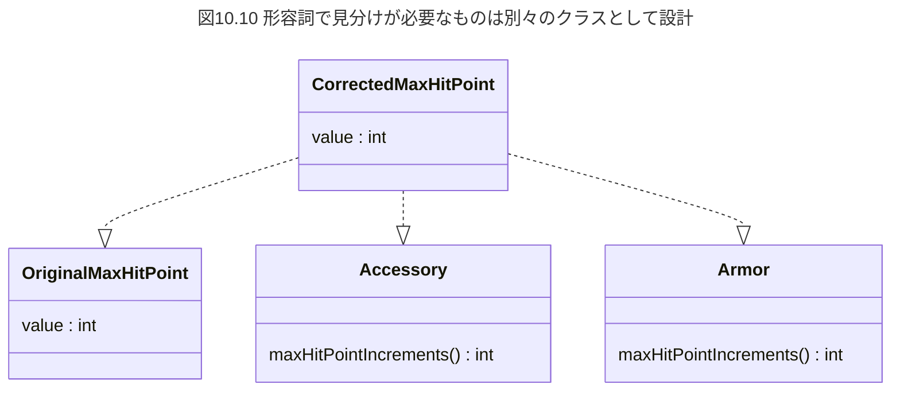
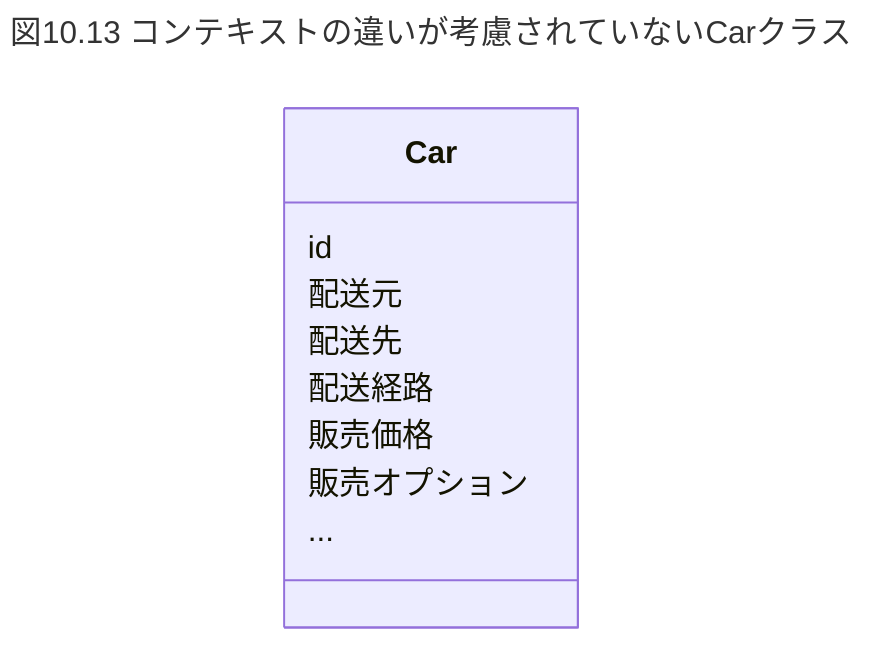
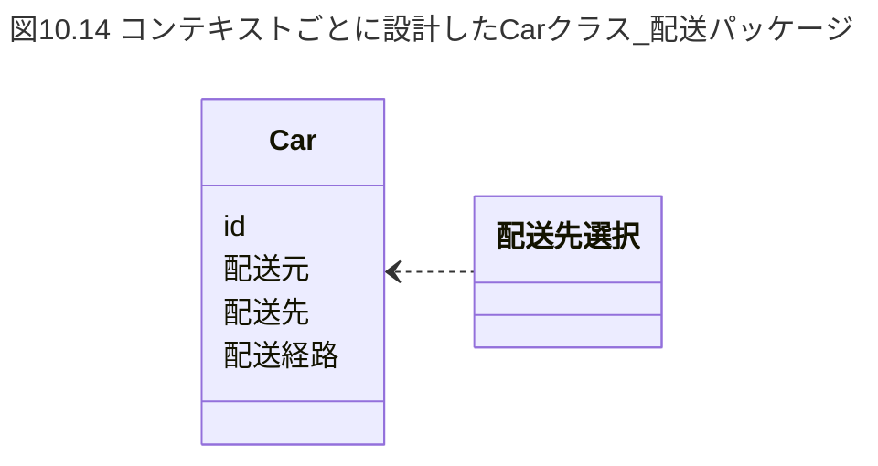
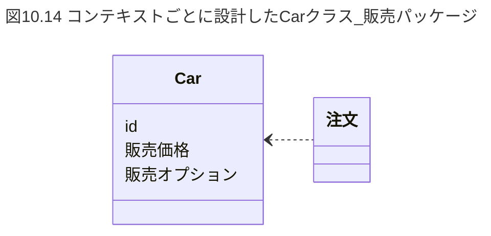
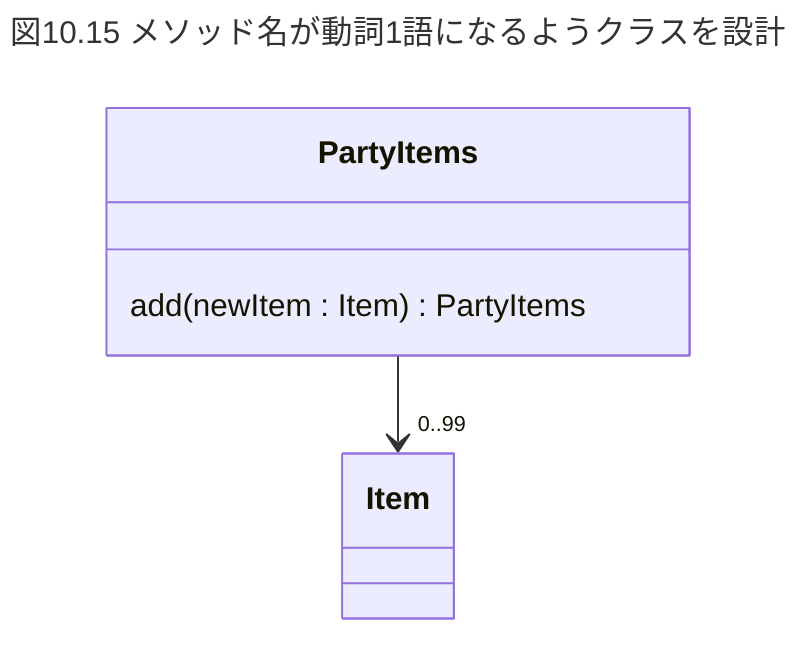

# 10. 名前設計 あるべき構造を見破る名前

適切な責務を考え、密結合を防止するには、クラスやメソッドへの名付け、すなわち命名も重要なポイントになる。  
名前をないがしろにすると、責務が入り乱れて密結合になったり、巨大化して神クラスになったりする。  

本章では、名前をないがしろにした時、どんな悪魔が生まれてしまうのか、悪魔退治のためにはどんな命名をすればいいのか、悪魔に打ち勝つための命名設計の方法を解説する。  

図10.1 名前をどう付けるか、本来は一大事だ  
  

本章全体に共通する考え方の基本は、**目的駆動名前設計**となる。  
ソフトウェアで達成したい目的をベースに名前を設計(命名)する。  
※目的駆動名前設計は著者が考えた造語。  

表10.1 ソフトウェアで達成したい目的の例  
|ソフトウェア|目的の例|
|---|---|
|ECサイト|キャンペーンセールで顧客の購買意欲を喚起したい、まとめ買いを励行させて配送料低減を実現したい。|
|ゲーム|武器の強化やカスタマイズを楽しんでほしい、罠による対戦駆け引きを楽しんでほしい|
|社内向けライブラリ|自部門の開発生産性を高めたい、複数の製品ラインナップを同じ方法で制御できるようにして開発を楽に進めたい|

目的駆動名前設計は、名前から目的や意図が読み取れることを特徴とする。  
そして名前「設計」と関している通り、これまで紹介したオブジェクト指向設計や単一責任原則を守る設計のように、問題解決を意図した作りにする。  

なお、顧客向けのプロダクト開発においては、「会社の事業的にどういう目的を達成したいのか」というビジネス目的を考えることになるため、ビジネス目的を中心に話を進める。  

---
---

## 10.1 悪魔を引き寄せる名前

まずは、名前設計が不十分なために悪魔を呼び寄せてしまうケースを取り上げる。  
例えばECサイトでの商品。  
ありがちなのは、商品をそのまま「商品クラス」と設計してしまうこと。  

図10.2 巨大な商品クラス  


ECサイトは商品を中心に成り立っている。  
出品、予約、注文、発送など、商品を取り扱うユースケースが沢山ある。  
従って、単純な商品クラスは往々にして様々なユースケースのクラスと関係してしまいがちである。  
商品クラス自体も、結びついたクラスに関係するロジックを持ち始め、どんどん巨大化複雑化して密結合状態になってしまう。  

こうして巨大化した商品クラスに対し仕様変更が発生した場合どうなるだろうか？  
変更影響により動作にバグが生じないか、商品クラスに関連のあるクラスをすべてチェックしなければならなくなることがよくある。  
影響範囲が広すぎるために、開発生産性が低下する。  

図10.3 広すぎる影響範囲  


---

### 10.1.1 関心の分離

商品クラスはなぜこんな状態になっているのだろうか。  

よく見てみよう。  
商品の周囲には、予約、注文、発送など様々な関心事が取り巻いている。  
そして商品クラスは様々な関心事と結びつき、結びついた関心事のロジックを持ってしまっている。  
すなわち密結合になっている。  

図10.4 関心事に分離し隔離する  

``` txt
        |         |
関心事A | 関心事B | 関心事C
        |         |
```

密結合を解消し、疎結合高凝集にするためには**関心の分離**が重要となる。  
関心の分離とは「関心事、つまりユースケースや目的、役割ごとに分離する」というソフトウェア工学における考え方である。  

つまり商品クラスは**関心事それぞれのクラスへの分割が必要**、と考えられる。  
以下のように関心事それぞれに商品クラスを分割してみる。  

図10.5 関心事ごとに分割してみる  
  

---

### 10.1.2 関心事にふさわしい命名

分割はしてみたが、すべてのクラスに「商品」と命名はできない。  
どうすればいいだろうか。  
違う名前を付けられないか検討してみる。  

例えば、注文目的の商品は何と呼べるだろうか。  
「注文品」と呼ぶのはどうだろうか。  
同じ要領で、予約では予約品、発送では発送品と呼び変えてみた。  

図10.6 よりふさわしい名前に変えてみる  
  

**関心事にふさわしい命名**ができたと思われる。  

後は、分離したいクラスそれぞれに、各関心事にふさわしいロジックをカプセル化すれば良いだろう。  
例えば、注文品クラスならば、商品注文に関するロジックだけを内部にカプセル化すれば良い。  
(在庫品、予約品、注文品、発送品が同じ商品化(一意性の担保)については、同じユニークIDを使うことで解決する)  

こうすることで、関心の分離により疎結合高凝集が果たされる。  
関心事それぞれでクラスを疎結合高凝集にしておけば、例えば注文に関して仕様変更が生じた場合、注文関連のクラスだけに注意を払えば良くなる。  
**影響範囲が低減**し、開発生産性が向上する。  

図10.7 仕様変更時の影響範囲が小さくなる  
  

---

### 10.1.3 大雑把で意味が不明瞭な名前

開発初期に決めた名前は、大雑把であることが多い。  
大雑把だと何がまずいのだろうか？  
開発現場では、下記のようなことが非常に多く見受けられる。  

>社員A「今度の仕様変更で、開発中のECサイトに予約機能が追加される。予約のロジック追加が商品周りでも必要だと思うけど、どこに実装しよう？」  
>社員B「商品クラスがすでにあるじゃないか。商品クラスに実装しちまえよ」  

「商品」という名が大雑把すぎて、商品に関するあらゆるロジックが実装できそうに見えてしまう。  
大雑把で意味が広い名前は、あらゆるロジックを引き付けてしまう、強力な心理的引力が働く。  

図10.8 「商品」は意味がとても広い  
  

「商品」は販売目的を体現していそうな名前に見えるが、予約、注文、発送といった様々な目的に使われやすい、いい加減な名前であることが分かる。  
これは陥りがちな罠となる。  

こうした目的不明なクラスを**目的不明オブジェクト**と著者は呼称している。  
目的不明オブジェクトは、あっという間に巨大化してしまう。  

こうした事態に陥らないよう、関心の分離を意識した名前を設計する。  
関心の分離には、ビジネス目的を名前として表現することがポイントになる。  

---
---

### 10.2 名前を設計する - 目的駆動命名設計

著者はクラスやメソッドに名付けることを、「命名」ではなく、「**名前設計**」と呼称している。  
ここでの設計は「ある課題を解決するための仕組みや構造を、考えたり、作り上げたりすること」と定義する。  

**プログラミングにおける名前の役割は、可読性を高めることだけではない**と考える。  
※書籍「リーダブルコード」などは可読性に強く注目している。  
関心の分離を意識し、ビジネス目的に沿った名前を付与することは、疎結合高凝集を実現する上で重要である。  
設計上大きな意味があるため、「**名前を設計する**」と言う。  

目的駆動名前設計は、目的をベースに名前を設計する。  
ソフトウェアで達成したい目的や意図を、名前から読み取れるようにする。  
重要なポイントは以下のとおりである。  

- 可能な限り具体的で、意味範囲が狭い、特化した名前を選ぶ  
- 存在ベースではなく、目的ベースで名前を考える  
- どんな関心事があるか分析する  
- 声に出して話してみる  
- 利用規約を読んでみる  
- 違う名前に置き換えられないか検討する  
- 疎結合高凝集になっているか点検する  

順番に説明していく。  

---

### 10.2.1 可能な限り具体的で、意味範囲が狭い、目的に特化した名前を選ぶ

目的駆動名前設計で最も重要なポイントとなる。  

図10.9 目的に特化した名前を使う  
  

特定の目的の達成に特化した、きわめて意味範囲の狭い名前をクラスに付与している。  
※ここでの目的とは、ソフトウェアで達成したい目的を指す。  

そして、顧客向けプロダクト開発における目的は、「会社の事業的にどういう目的を達成したいのか」というビジネス目的となる。  
ビジネス目的に特化することで、以下の効果が生まれやすくなる。  

- 名前とは無関係なロジックを排除しやすくなる。  
- クラスが小さくなる。  
- 関係するクラスの個数が少なくなる。結合度(15.5.4)が低減する。  
- 関係クラス個数が少ないので、仕様変更時に考慮を要する影響範囲が小さく済む。  
- 目的に特化した名前であるため、どこを変更すればよいかすぐ探し出せる。  
- 開発生産性が向上する。  

---

### 10.2.2 存在ベースではなく、目的ベースで名前を考える

ビジネス目的に特化した名前とはどんなものなのか、具体的に解説する。  

まずは、目的に特化していないケースを考えてみる。  
たとえば「人」や「ユーザー」といった、人物がただ存在しているだけのような、存在ベースの名前を考えてみる。  
こうした名前をECサイトのロジックに利用したらどうなるだろうか。  
ECサイトの利用者は、個人以外に法人である可能性もある。  
「ユーザー」が個人と法人両方の意味を持ち、ロジックが混乱する可能性がある。  
(弊害については第13章のモデリングを参照)  

単純に存在を示すだけの名前は、意味が多重になりがちで、目的不明オブジェクトになる。  
ロジックレベルで混乱をきたしてしまう。  

従って、具体的な目的が明確にわかるような、目的ベースの名前にする。  

表10.2 目的ベースで考えた命名の例  
|存在ベース|目的ベース|  
|---|---|
|住所|配送元、配送先、勤務先、本籍地|
|金額|請求金額、消費税額、延滞保証料、キャンペーン割引料金|
|ユーザー|アカウント、個人プロフィール、職務経歴|
|ユーザー名|アカウント名、表示名、本名、法人名|
|商品|入庫品、予約品、注文品、配送品|

ECサイトでの住所を利用する目的は、商品の配送である。  
従って、単に「住所」といった無味乾燥な存在ベースの名前ではなく、「配送元」「配送先」と目的特化の名前にすると混乱を防げる。  

「金額」は単に存在ベースであり、どうとでも解釈可能である。  
目的特化にすると、「請求金額」「消費税額」「延滞保証料」「キャンペーン割引料金」などが考えられる。  
「ユーザー名」にしても、「アカウント名」「表示名」「本名」などのように、目的に応じた命名が考えられる。  

---

### 10.2.3 どんなビジネス目的があるか分析する

ビジネス目的に特化した命名をするには、どんなビジネス目的があるか網羅する必要がある。  
そのために、ソフトウェアが対象とする目的や事柄を分析する必要がある。  

例えば、ECサイトでは出品、注文、発送、キャンペーン。  
ゲームでは、武器、モンスター、アイテム、タイアップイベント。  
SNSでは、メッセージ、フォロー、タイムラインなどがある。  
ソフトウェアによって取り扱う目的や事柄が違う。  

登場人物や事柄を列挙したり、関係性を整理したり、分析してみよう。  
チームで集まって、ホワイトボードや模造紙に書いてみるのがいいだろう。  
付箋を使えば、関係し合うものをグルーピングするなど、考えの整理がより捗るだろう。  

---

### 10.2.4 声に出して話してみる

人が脳内で考えていることは意外なほどぼんやりしていて、ハッキリしないものだ。  

先述の分析活動には、陥りがちな罠がある。  
名前が沢山書きだされても、慣れていないと名前の背後にあるビジネス目的まで書き出されることが中々ないのだ。  

名前も大事だが、どんな目的を達成したいのか、どう使われるのか、何と関係するのか、その理由など、背景と意図の認識が整理され、チームと一致していることが重要である。  

目的や意図の認識がお互いに違っていると、名前が十分にブラッシュアップされない。  
この課題の解決には、やはり声に出して話してみることが重要である。  

ビジネス面のことを良く知っている人と話あってみよう。  
目的や意図の認識に違和感がある場合は、会話中すぐフィードバックをもらえる。  
より正確で具体的なビジネス目的や、目的に沿った名前を引き出せることがある。  
つまり、会話それ自体がリアルタイム分析行為になるのだ。  

**ラバーダッキング**と呼ばれるデバッグ手法がある。  
これはプログラミングで何か問題が発生した時に、それを誰かに説明すると自ら原因に気づき、自己解決する手法である。  
ラバーダッキングの観点からも、声に出して話すのは分析行為として理に適っているのである。  

積極的に話し合い、会話の中に特化した名前がないか注意深く耳をそばだてよう。  
そして名前や関心事を集めていこう。  

この声にだして話す分析活動は、書籍「ドメイン駆動設計」の**ユビキタス言語**を由来としている。  
ユビキタス言語とは、チーム全体で意図を共有するための言葉である。  
同じ意図の名前を、会話、ドキュメント、クラス名やメソッド名で共通して使うことで、意図の減衰を防止し、設計のいびつさを解消するのに役立ちます。  
チームでユビキタス言語を作る時、会話し続け、継続的にブラッシュアップすることの重要さをドメイン駆動設計では説いている。  

---

### 10.2.5 利用規約を読んでみる

利用規約には、サービスの取り扱いやルールが極めて厳密な言い回しで書かれており、特化した名前の参考になる。  
以下は、架空のフリーマーケットサービスにおける利用規約の一部である。  

>**購入者**が商品購入手続きを完了した時点をもって、**売買契約**が**締結**されたものします。  
>売買契約が締結した場合、**出品者**は当社に**サービス利用料**を支払うものとする。  
>サービス利用料は、売買契約が締結した時点の商品の**販売価格**に、**販売手数料率**を乗じた金額となる。  

「購入者」「出品者」「売買契約」など、厳密が名前が色々あるのが分かる。  
これらを参考にすると、利用者を表すクラスは単に「ユーザー」クラスではなく、「購入者」クラスや「出品者」クラスに分けることができる。  

商品購入は「売買契約」クラス、および「締結」メソッドとして表現できそうだ。  
金額関係では、単に「料金」と命名された変数として実装されがちだが、利用規約を参考に「サービス利用料」クラスや「販売手数料率」クラスとして表現できるだろう。  
例えば、「サービス利用料」クラスは、リスト10.1に示す値オブジェクトとして設計できる。  

``` java
// リスト10.1
// サービス利用料クラス

class ServiceUsageFee {
    final int amount;

    // @param amount 料金金額
    private ServiceUsageFee(final int amount) {
        if (amount < 0){
            throw new IllegalArgumentException("金額が0以上ではありません。");
        }
        this.amount = amount;
    }

    // サービス利用料を確定する
    // @param salesPrice 販売価格
    // @param salesCommissionRate 販売手数料率
    // @return サービス利用料
    static ServiceUsageFee determine(final SalesPrice salesPrice,final SalesCommissionRate salesCommissionRate) {
        int amount = (int)(salesPrice.amount * salesCommissionRate.value);
        return new ServiceUsageFee(amount);
    }
}
```

determineメソッドは、利用規約上のサービス利用料の定義と合致するのが分かる。  
このServiceUsageFee.determineメソッドを、売買契約クラスの締結メソッドから呼び出す実装にすれば、「売買契約締結時にサービス利用料が決まる」規約と合致する。  
利用規約と実際のロジックに一貫性が生まれる。  

そのほか、販売手数料率が変動する仕様である場合は、販売手数料率を表現するSalseCommissionRateクラスに変動ロジックを実装するとよいだろう。  

サービス利用料が改訂される場合は、ServiceUsageFeeクラスを変更すればよいですし、販売手数料率が改訂される場合はSalesCommissionRateクラスを変更すれば良くなる。  
ビジネスルールとクラスが一致しているおかげで、正確に素早く変更できる。  

---

### 10.2.6 違う名前に置き換えられないか検討する

せっかく選んだ名前の意味範囲が十分に小さくなかったり、複数の意味を持ったりしてしまっている可能性が多々ある。  
違う名前に置き換えてみて、意味をもっと狭く出来ないか、違和感がないかなど検討してみよう。  

例えば、ホテルの宿泊予約システムを考えてみる。  
システム利用者には保守点検者もいるため、「ユーザー」と呼ぶのは意味が広すぎる。  
まず「顧客」と命名してみる。  
しかし、これでよいのだろうか？  

宿泊する人と、宿泊料金を支払う人が同じとは限らないケースがある。  
出張で宿泊料金を会社に請求するケースや、両親に旅行をプレゼントしたいケースが該当する。  

「顧客」では、宿泊客と支払う人が異なるケースの対応が難しくなるのは、容易に想像がつく。  
「顧客」に「宿泊する人」と「支払う人」の両方の意味が重なっているためである。  

この例では、「宿泊客」と「支払者」に名前を置き換えるのが得策だろう。  
また、違う名前を探すのには類語辞典が役に立つ。  

---

### 10.2.7 疎結合高凝集になっているか点検する

目的に特化した名前を選ぶと、目的以外のロジックを寄せ付けにくくする。  

目的だけのロジックが集まりやすく、高凝集になる。  
目的以外のロジックが混入しそうならば、名前を見直そう。  

また、ほかのクラスといくつ関連付けられているか個数を確認しよう。  
先に挙げた商品クラスのように、何個も関連付けられているのは良くない兆候である。  
密結合の危険性がある。  
もっと狭い意味の、特化した名前を探してみよう。  
複数の意味を持っているなら分解しよう。  
関連個数が少なければ少ないほど影響範囲が低減される。  

※特化した名前を洗い出していくと、現実世界の物理的存在と名前はからなずしも1:1の関係にはならず、1:Nの関係になっていく。(第13章のモデリングを参照)  

---
---

## 10.3 設計時の注意すべきリスク

名前設計において注意すべき点がいくつかある。  

---

### 10.3.1 名前無頓着になるな

目的駆動名前設計の考えは、「名前に注意を払い、名前とロジックを対応付けること」を前提としている。  
従って、名前に無頓着だとすべてが瓦解する。  

**チーム開発においては、命名が重要であり、名前とロジックが対応する前提であること、名前がプログラム機構を大きく左右すること**を、チーム内で約束しよう。  

---

### 10.3.2 仕様変更時

開発中の度重なる仕様変更に伴い、開発の文脈で言葉が意味するところはどんどん変化していくことがある。  
そのため、名前設計には見直しが必要となる。  

例えば開発初期に顧客クラスがあり、そのクラスは「個人顧客」を表現したものだっとする。  
ところが、その後の仕様変更により「法人顧客」も扱うようになり、法人について回る登記番号や組織名が顧客クラスに紛れ込んでしまうような状況である。  
個人顧客なのか法人顧客なのか、顧客クラスの中でロジックが混乱してしまう、ということがありえてしまう。  

異なる意味が混入しそうな場合は、名前が意味するところを見直したり、名前を変えたり、クラスを別々に分けるなどするのが肝要となる。  
例えば個人顧客クラスと法人顧客クラスを容易する、といった設計である。  

---

### 10.3.3 会話には登場するのに」コード上に登場しない名前に注意

会話には登場するのにコード上には登場しない名前、というものには注意が必要。  
図書館の貸し出しサービス開発を例に見ていこう。  
次のような会話が、サービス開発では頻繁に発生する。  

>社員A「さっきの議題に上がっていた『要注意会員』は、もう実装されてるんですか？」  
>社員B「うん、されてるよ」  
>社員A「え、どのクラス何ですか？」  
>社員B「Userクラスだよ」  
>社員A「Userクラスが『要注意会員』なんですか？」  
>社員B「いやいや、条件があって、インスタンス変数『貸出延滞回数』か『図書汚損回数』が一定値を超えているUserクラスが『要注意会員』なんだよ」  
>社員A「えー、でもソースコードのどこにも『要注意会員』なんて書いてないじゃないですか」  
>社員B「…、まぁ…確かにそうではあるんだけど…」  

**会話に登場する重要な概念が、ソースコード上で名前も付けられず、雑多なロジックの中に埋没していることが本当に頻繁に見受けられる。**  

この例のように、詳しい人に聞かないと理解が難しくなる。  
詳しい人がチームから抜けてしまったら、困難さは一層増すことになる。  

また、こうした「名無しロジック」はソースコードのあちこちに、無秩序に書きなぐられる傾向にある。  
なぜなら名前が付いていないと、メソッドとしても、クラスとしても設計されないためである。  
そして既存のソースコード内に、単に仕様通りに動作するようロジックがべた書きされることになる。  

こうなってしまうと、例えば要注意館員に関して仕様変更が発生した時、どこからどこまでが要注意会員に関係するロジックなのか、多大な労力をかけて探し回らなければならなくなる。  
ソースコード上で名前がついてないわけなので、その苦労は一層厳しいものになる。  

こうした地獄の苦しみから逃れるためには、会話に登場する名前にもっと神経質になる必要がある。  
そして、その名前を用いたメソッドやクラスを設計することが大事になる。  

---

### 10.3.4 形容詞で区別が必要な時はクラス化のチャンス

違いの見分けが難しいコードを、**口頭でひらすら形容詞を付けて同僚に説明する状況**が、システム開発では頻繁に生じる。  

ゲーム開発を例に説明する。  
多くのRPGでは、最大ヒットポイントが設けられている。  
中には最大ヒットポイントの増加効果を持つ装備品もある。  
この例では、アクセサリに最大ヒットポイントの増加効果が備わっている仕様で、次のように実装されていたとする。  

``` java
// リスト10.2
// アクセサリの最大ヒットポイント増加効果を適用

int maxHitPoint = member.maxHitPoint + accessory.maxHitPointIncrements();
```

その後、仕様変更により、体防具にも最大ヒットポイントの増加効果を追加することになったとする。  
新入社員が実装担当になりました。  
新入社員は前述の実装を知らず、別の個所に次のように実装したとする。  

``` java
// リスト10.3
// 体防具の最大ヒットポイントの増加効果を適用

maxHitPoint = member.maxHitPoint + armor.maxHitPointIncrements();
```

ところが仕様通りに動作しない。  
新入社員は先輩社員に相談する。  

>新入社員「すみません、MemberクラスのmaxHitPointが最大ヒットポイントなんですよね？」  
>先輩社員「そうだよ」  
>新入社員「Member.maxHitPointに体防具の最大ヒットポイントの増加値を加算すると、上手く動かなくなるんです。アクセサリの最大ヒットポイント増加効果がなくなるようで…」  
>先輩社員「ああー…。Member.maxHitPointはね、アイテムによる増加効果が全く反映されてない、『もともとの』最大ヒットポイントなんだよ。アクセサリによる補正効果は、別の個所で計算してるんだ。ほら、ここのロジックを見てごらん。ここで『補正された』最大ヒットポイントを計算してるんだよ」  
>新入社員「じゃあ僕の実装では、この処理の後に、『もともとの』最大ヒットポイントに体防具の効果を加算して、『補正された』最大ヒットポイントを計算し直してしまっていたんですね」  

原因に気づいた新入社員は修正し、仕様通りの動作を確認する。  

``` java
// 10.4
// 最大ヒットポイントの加算処理を修正

int maxHitPoint = member.maxHitPoint + accessory.maxHitPointIncrements() + armor.maxHitPointIncrements();
```

新入社員はなぜこのような事態に陥ったのだろうか。  
member.maxHitPointが最大ヒットポイントを示すことは把握していたようだが、それがどんな最大ヒットポイントなのか理解していなかった。  
それに対して、先輩社員は「もともとの最大ヒットポイント」や「補正された最大ヒットポイント」といった形容詞を用いて、最大ヒットポイントの違いを口頭で説明していた。  

ところが、最大ヒットポイントはmaxHitPointと表現されているだけで、「もともとの最大ヒットポイント」や「補正された最大ヒットポイント」が分かるような名前にはなっていない。  

このように、意味の異なるものや、条件によって振る舞いが異なるものを、同じ名前・似たような名前で表現しているために違いの見分けが難しくなることがある。  

チームメンバーがしきりに「もともとの～」「補正された～」などと形容詞を使って違いを説明する、という状況が実際に頻繫にある。  
この例では詳しい人(先輩社員)がいたために違いがすぐに分かったが、詳しい人がチームから抜けてしまうと、周囲のロジックから違いを類推しなければならなくなる。  
条件が複雑だと一層困難になる。  

こうした事態を防止するためには、あいまいな命名をせず、意味の違いがわかる命名が大事である。  
このゲームの例では少なくとも次のように命名すべきであった。  

- もともとの最大ヒットポイント : originalMaxHitPoint  
- 補正された最大ヒットポイント : correctedMaxHitPoint  

改善はそれだけにとどまらない。  
もともとの最大ヒットポイントや補正された最大ヒットポイントは、様々なユースケースでの利用が容易に想像できる。  
これらの最大ヒットポイントを単純なint型変数で実装していると、意味の違いが名前で正しく表現されているかいちいち注意しなければならないし、関係性を表現する実装が五月雨式になる、いわゆる低凝集に陥る。  

形容詞を付けてまで違いを表したいものは、それぞれクラスとして設計しよう。  
補正された最大ヒットポイントは、もともとの最大ヒットポイントや装備品により決定する関係性がある。  
この関係をクラスで構造化するのである。(図10.10)  

もともとの最大ヒットポイントを値オブジェクトとして設計する。  

``` java
// リスト10.5
// もともとの最大ヒットポイントを表現するクラス

class OriginalMaxHitPoint  {
    private static final int MIN = 10;
    private static final int MAX = 999;
    final int value;

    OriginalMaxHitPoint(final int value) {
        if (value < MIN || MAX value ) {
            throw new IllegalArgumentException();
        }
        this.value = value;
    }
}
```

補正された最大ヒットポイントも値オブジェクトで設計する。  
コンストラクタの引数からわかるように、もともとの最大ヒットポイントや、各種防具により値が決まる構造になっている。  

``` java
// リスト10.6
// 防具などにより補正された最大ヒットポイントを表現するクラス

class CorrectedMaxHitPoint {
    final int value;
    
    CorrectedMaxHitPoint(final OriginalMaxHitPoint originalMaxHitPoint, final Accessory accessory, final Armor armor) {
        value = originalMaxHitPoint.value + accessory.amxHitPointIncrements() + armor.maxHitPointIncrements();
    }
}
```



このように意味の違うものそれぞれをクラスとして設計し構造化することで、各概念の関係性が理解しやすくなる。  
最大ヒットポイントの補正仕様が変更される場合、CorrectedMaxHitPointクラスを中心に見れば良くなる。  

違いのよくわからないロジックを同僚に尋ねる場合、形容詞に注意を傾けよう。  
いくつか例を挙げる。  

- このフラグが立っている時のUserは要注意会員  
- この行のpriceは新品価格で、次の行のpriceは中古価格  
- Ticketクラスは、年齢が60歳以上ならシニア料金用になって、さらに平日なら平日のシニア料金用に変わるんだ  

このように違いを形容詞で表現している場合、それぞれクラスとして設計できないか検討してみよう。  

---
---

## 10.4 意図がわからない名前

ここから先は、命名で頻繁に陥りがちな様々な悪しきケースと、その対策方法を紹介していく。  
まずは意図や目的が分からない名前で行く。  
例えば次のようなコードになる。  

``` java
// リスト10.7
// tmpだらけで意味不明

int tmp3 = tmp1 - tmp2;
if (tmp3 < tmp4){
    tmp3 = tmp4;
}
int tmp5 = tmp3 * tmp6;
return tmp5;
```

計算結果を一時的に格納するためのローカル変数にtmpなどと名付けられる場合がある。  

こうした名前では、何を目的としているのか意味が非常にわかりにくくなる。  
目的駆動名前設計の観点で考えると、関心の分離に貢献しない。  
責務が混乱し、密結合になる。  

理解の難しさから、都度翻訳作業が必要になる。  
例えば、仕様変更の依頼があったとき、対応するメソッドや変数が何であるか頭の中で翻訳作業が必要になる。  
また、チームに新しく参加したメンバーに対しての説明コストが増大する。  
翻訳の課題を解決するため、スプレッドシートで用語集や対応表を作成するケースがある。  
しかし、この手の資料はメンテナンスがおろそかになりがちになる。  
仕様変更に伴い意味が変わってきたり、説明が抜けたりする。  
翻訳の時間がかかるということは、当然開発速度の低下を意味する。  

人間の注意力には限界がある。  
仕様とロジックを相互にいつでも正確に翻訳できるわけではない。  
不注意により誤って解釈する可能性がある。  
意図不明な名前は、解釈の誤りをさらに増大させる。  
誤った解釈に基づいて実装されたロジックは当然だが、バグとなる。  

以下に、意図不明な名前に陥るケースを紹介する。  

---

### 10.4.1 技術駆動命名

プログラマーは職業柄、プログラミング関連のことで頭がいっぱいである。  
すると、命名のしかたがプログラミング用語やコンピューター用語由来のものになってしまうことがある。  
技術ベースでの命名を技術駆動命名と呼ぶ。  

本書冒頭のリスト1.1では、型名を表すInt、メモリ制御を表すMemoryやFlagなど、プログラミング用語やコンピューター用語に基づいた名前が用いられていた。  
MemoryStateManagerやchangeIntValue01といった命名である。  
これらは典型的な技術駆動命名となる。  
技術駆動命名では意図が分かりにくくなる。  

表10.3は代表的なコンピューター技術用語、プログラミング技術用語の例である。  
これらはソフトウェアの実現手段であり、ビジネス目的を指し示す命名にはふさわしくないので注意が必要である。  

表10.3 技術駆動命名の例  
|種類|例|
|---|---|
|コンピューター技術由来|memory,cache,thread,registerなど|
|プログラミング技術由来|function,method,class,moduleなど|
|型名由来|int,str(string),flag(boolean)など|

---

### コラム 技術駆動命名を用いる分野もある

組み込み系など、ハードウェアに近いレイヤーのミドルウェアでは、メモリやプロセッサなど直接ハードウェアにアクセスするロジックが多々ある。  
そのため、技術駆動命名になるのは仕方がない側面がある。  
それでも、可能な限り目的や意図を伝えられるよう命名を心がけることが肝要である。  

---

### 10.4.2 ロジック構造をなぞった名前

リスト10.8はどんなメソッドだろうか。  

``` java
// リスト10.8
// ロジック構造をなぞった名前

class Magic {
    boolean isMemberHpMoreThanZeroAndIsMemberCanActAndIsMemberMpMoreThanMagicCostMp(Member member) {
        if (0 < member.hitPoint) {
            if (costMagicPoint <= member.magicPoint) {
                return true;
            }
        }
        return false;
    }
}
```

これは、ゲームにおいてメンバーが魔法を唱えられるかどうかを判定するロジックとなっている。  

- ヒットポイントが0より大きく生存していること  
- 行動可能であること(canAct)  
- 魔法力が残存していること  

この3つの条件をすべて満たしている場合に魔法を唱えられると判定し、trueを返す。  
ところが、このメソッドはisMemberHpMoreThenZeroAnd...と、ロジック構造をそのままなぞったような命名になっている。  
何を意図しているのかがメソッド名から伝わってこない。  
実現したい目的の理解が不十分だと、この手の名前になりがちである。  

意図や目的が分かるよう命名しよう。  

``` java
// リスト10.9
// 意図や目的がわかる名前に改善

class Magic {
    boolean canChant(final Member member) {
        if (member.hitPoint <= 0) return false;
        if (!member.canAct()) return false;
        if (member.magicPoint < costMagicPoint) return false;
        return true;
    }
}
```

---

### 10.4.3 驚き最小の原則

次のコードを実行すると何が起こるだろうか。  

``` java
// リスト10.10
// 一見、商品数を返すだけのように見えるが…

int count = order.itemCount();
```

注文商品数を返してくれそうに見える。  
ではitemCountメソッドの中身を見てみよう。  

``` java
// リスト10.11
// メソッド名から類推できないことをやっている

class Order {
    private final OrderId id;
    private final Items items;
    private GiftPoint giftPoint;

    int itemCount() {
        int count = items.count();
        // 注文商品数が10個以上ならお買い物ギフトポイントを100追加する。
        if (10 <= count) {
            giftPoint = giftPoint.add(new GiftPoint(100));
        }
        return count;
    }
}
```

なんと、注文商品数を返す以外に、お買い物ギフトポイントの追加までやっている。  
**驚き最小の原則**と呼ばれる設計原則がある。  
使う側が想像した通りに、予想外な驚きが最小になるよう設計する考え方を言う。  
よそ通りにストレスなく利用できるよう、ロジックと名前を対応付ける設計が大事である。  

驚き最小の原則に従えば、itemCountメソッドは注文商品数の返却のみに徹するべきである。  
ギフトポイントを追加すべきかの判定ロジックはshouldAddGiftPointメソッド、ギフトポイントの追加を試みるロジックはtryAddGiftPointメソッドというように、ロジックの意図と一致するよう名前を設計する。  

``` java
// リスト10.12
// ロジックの意図と名前を一致させる

class Order {
    private final OrderId id;
    private final Items items;
    private GiftPoint giftPoint;

    int itemCount() {
        return items.count();
    }

    boolean shouldAddGiftPoint() {
        return 10 <= itemCount();
    }

    void tryAddGiftPoint() {
        if (shouldAddGiftPoint()){
            giftPoint = giftPoint.add(new GiftPoint(100));
        }
    }
}
```

初めは、きちんとロジックの意図と名前が一致するよう実装したとしても、仕様変更時に、既存のメソッドについついロジックをべた書きで追加しがちになる。  
すると名前とロジックが次第に乖離し、驚き最小の原則に反するようになっていく。  
メソッドだけでなく、クラス単位でもズレが生じる。  
これは本当に頻繁に発生するので、注意する必要がある。  

ロジック変更の際は、驚き最小の原則を意識しよう。  
ロジックと名前にズレがある時、名前を見直し、メソッドやクラスを意図ごとに分けよう。  

---
---

## 10.5 構造を大きく歪ませてしまう名前

名前がクラス構造に大きな悪影響を及ぼすものがある。  

---

### 10.5.1 データクラスに陥る名前

ProductInfoは商品情報を格納するクラスである。  
構造からわかるようにデータクラスである。  

``` java
// リスト10.13
// 商品情報クラス

class ProductInfo {
    int id;
    String name;
    int price;
    String productCode;
}
```

~infoや~Dataと命名されたクラスは、「データだけ持たせるクラスなんだ、ロジックを実装しちゃダメなんだ」と読み手に印象付けてしまう。  
1.3で解説したように、低凝集に陥る。  

**~Data,~Infoなどといったデータのみを想起させる名前は避けよう**。  
ProductInfoはProdutへ改善すべきである。  
そしてオブジェクト指向設計に基づき、インスタンス変数に強く関係するロジックをProductクラスにカプセル化する。  

#### DTO(Data Transfer Object)

一部例外的にデータクラスを用いる場合がある。  
更新責務と参照責務とでモジュールを分離したコマンド・クエリ責務分離(CQRS)と呼ばれるアーキテクチャーパターンがある。  
CQRSにおける参照系とは、データベースから値を取得するだけの処理系で、もっぱら画面表示に用いられる。  
単に取得して表示するだけなので、計算やデータの変更は伴わない。  
この場合、データベースの値を格納して表示側に転送するだけのクラスとして設計する。  

``` java
// リスト10.14
// DTO(Data Transfer Object)の例

class ProductDto {
    final String name;
    final int price;
    final String productCode;

    ProductDto(final String name, final int price, final String productCode) {
        this.name = name;
        this.price = price;
        this.productCode = productCode;
    }
}
```

これはDTO(Data Transfer Object)と言い、データ転送用途に使われる設計パターンとなる。  
値変更の必要がないので、インスタンス変数はfinalで宣言し、コンストラクタで値が確定するようにする。  
参照系のみの用途であるため、更新系で使ってはいけない。  
更新系で用いると低凝集に陥る。  

このように、データクラスを全く使ってはいけない、というわけではなく、意図を理解した上で使い分けられることが肝心である。  

---

### 10.5.2 クラスが巨大化する名前

クラスの巨大化複雑化を誘発する名前が存在する。  
この事態を招く代表的な名前に、「Manager」がある。  
ゲームを開発する架空の状況を例に説明する。  

開発初期に、ゲーム内のメンバーを一元管理するMemberManagerクラスが作られた(リスト10.15)。  
MemberManagerの各メソッドを使えば、メンバーのパラメータを取得したり更新したりできる類のものである。  
管理する趣旨から、メンバーに関するあらゆるデータはすべてMemberManagerが保有する作りとする。  

``` java
// リスト10.15
// メンバーを管理するクラス

class MemberManager {
    // メンバーのヒットポイントを取得する。
    int getHitPoint(int memberId) {
        // ...
    }

    // メンバーの魔法力を取得する。
    int getMagicPoint(int memberId) {
        // ...
    }
}
```

開発が進み、歩行アニメーションを実装する段階に来た。  
MemberManagerはメンバーに関するあらゆるデータを保有する作りとなっている。  
アニメーションに必要な画像のファイル名やパターンデータも保持している。  
そのため、歩行アニメーションのメソッドはmemberManagerに実装されたとする。  

``` java
// リスト10.16
// 歩行アニメーション処理追加

class MemberManager {
    // 中略

    // メンバーの歩行アニメーションを開始する。
    void startWalkAnimation(int memberId) {
        // ...
    }
}
```

スプレッドシート上でメンバーのパラメータ調整ができるよう、パラメータをCSV出力するメソッドも追加された。  

``` java
// リスト10.17
// CSV出力処理追加

class MemberManager {
    // 中略

    // メンバーの能力値をCSV出力する。
    void exportParamsToCsv() {
        // ...
    }
}
```

さらに以下の仕様への対応が必要になってきました。  

- 特定の敵が生存してるかによってメンバーの強さが変化する。  
- メンバーの特定の攻撃によりBGMが変化する。  

急遽対応するため、MemberManagerには敵の生存を確かめるenemyIsAliveメソッドと、BGM再生用にplayBgmメソッドが追加された。  

以上、様々な仕様や要望によりMemberManagerクラスはリスト10.18のようになった。  

``` java
// リスト10.18
// 巨大化したMemberManagerクラス

// メンバーを管理するクラス
class MemberManager {
    // メンバーのヒットポイントを取得する。
    int getHitPoint(int memberId) {
        // ...
    }

    // メンバーの魔法力を取得する。
    int getMagicPoint(int memberId) {
        // ...
    }
    // メンバーの歩行アニメーションを開始する。
    void startWalkAnimation(int memberId) {
        // ...
    }

    // メンバーの能力値をCSV出力する。
    void exportParamsToCsv() {
        // ...
    }

    // 敵が生存しているかどうかを返す。
    boolean enemyIsAlive(int enemyId) {
        // ...
    }

    // BGMを再生する。
    void pkayBgm(String bgmName) {
        // ...
    }
}
```

このクラスの責務は何だろうか？  
単一責任の原則に基づき考えてみる。  

getHitPointはヒットポイントに関する責務、startWalkAnimationはアニメーション表示に関する責務である。  
exportMemberParamsToScvはメンバーに関係する。  
しかし、関心事はファイル出力であり、これも他とは違う責務となっている。  
enemyIsAliveやplayBmgに至っては、もはやメンバーにすら関係しない責務となっている。  
多くの責務を抱え、単一責任の原則に違反している。  

実際の開発でも、Managerと名付けられたクラスは様々な責務のロジックが追加されがちである。  
そしてあっという間に数千行規模の神クラスになってしまう。  

原因はManagerが意味する「管理」の意味が広すぎてあいまいだからである。  
管理とは具体的に何をするものなのだろうか？  
ヒットポイントの制御？それともアニメーションの制御？  
管理と名付けるとなんでもできそうに感じてしまう。  

メンバーの仕様が変更されたとき、「とりあえずMemberManagerあたりにロジックを追加しておけばいいや」と、心理的に誘導されやすくなる。  
単に「関係してそう」というだけで、異なる責務のロジックがどんどん集まりだしてくる。  
あらゆるロジックがごった煮の、秩序なき状態に陥ってしまう。  
※本書のサンプルコードには、DiscountManagerやOrderManagerなどの、多くのManagerクラスが登場するが、実はあれらは良くない名前なのだ。  

Managerでは意味が広すぎる。  
意味の狭い概念を見つけていこう。  
Managerの中にどんな概念が含まれているのか丁寧に列挙していこう。  

MemberManagerを例にすると、ヒットポイント、魔法力、アニメーション、CSV、敵(および生存状態)、BGMといった概念が取り扱われている。  
概念を1つ1つ分析して、単一責任になるようクラス設計していく。  
例えば、ヒットポイントに責任を持つHitPointクラスや、歩行アニメーションの動作に責任を持つWalkAnimationクラスとして設計する。  

Managerに近い名前としてProcessorやControllerなども注意が必要だ。  
これらも意味が広く解釈されがちで、巨大化しやすい。  
ControllerはWebフレームワークのMVC構造に登場するパターンでもある。  
MVCにおけるControllerは、受け取ったリクエストパラメータを他のクラスへ渡す責務に留めるべきである。  
金額計算をしたり、予約可否を判断したりなどの分岐ロジックが実装されていれば、単一責任原則違反となる。  
責務の異なるロジックは他のクラスとして定義しよう。  

---

### コラム クソコード動画「Managerクラス」

クソコード動画「Managerクラス」は、Managerと命名されたクラスにより引き起こされる弊害を描いた作品となっている。  

劇中では、WorkflowManagerと命名されたクラスにありとあらゆる処理が実装されている。  
しかし、その後に仕様変更の依頼が来るが、WorkflowManager内があまりにもごちゃついていて、どこを修正してよいのかわからない。  
当てずっぽうで修正を試みたところ、影響が飛び火し、他の個所でバグが発生。  
どこを修正して回ってもバグが起きてしまう…、という悲劇が描かれている。  

WorkflowManager…、直訳すると「処理フロー管理者」となるが、そもそもプログラム自体が処理フローの塊なのに、さらに「管理」が付くと、もはや変わるとか区別するといった概念が何もないのかと驚きに近い気持ちを覚えてしまう。  

弊害の根本原因は、やはりManagerという意味の広すぎる名前である。  
あらゆる処理を実装して良いような錯覚を覚えてしまう。  

クラス内のメンバーは、インスタンス変数でもメソッドでも、お互いにどのメンバーにもアクセスできる。  
一つのクラスにありとあらゆる処理が実装されると、どのメンバーがどのメンバーに関係し合っているのか、読み解くのが非常に困難になってしまう。  
クラス内のスコープが全てグローバル変数のような性質を帯びてくるのだ。  
劇中の登場人物は「どこを修正していいのかわからない」と困惑しているが、修正の影響範囲分析が困難で、いたずらに時間が過ぎていく経験をされた方は少なくないはずだ。  

大事なのはやはり目的単位でクラスを分けること。  
具体的で意味範囲が小さく、目的が分かる命名をすることだ。  
15.5.5のマジカルナンバー4を参考に、関係し合う概念の個数を確認すれば、影響範囲が十分に小さいかを検証できるだろう。  

こうした設計を序盤に丁寧にしていれば、劇中の彼らは助かっていたのかもしれない。  

<https://twitter.com/MinoDriben/status/1157554468201746432>  

---

### 10.5.3 状況によって意味や扱いが異なる名前

状況によって言葉は意味合いが変わる。  
例えば、「アカウント」という言葉は、金融業界では「銀行口座」を意味する一方で、コンピューターセキュリティでは「ログイン権限」を意味する。  
状況により意味が異なるのだ。  

アカウントの例はまだわかりやすい方で、目的や状況によってついて回る概念が全く異なることがある。  
例えば、自動車を取り扱うサービスについて考えてみる。  
状況(コンテキスト)が違うと、自動車と関係し合う概念には大きな違いが生まれる。  

- 配送コンテキスト : 自動車が貨物として配送されるコンテキスト。配送元、配送先、配送経路などが自動車に付いて回る。  
- 販売コンテキスト : ディーラーにより顧客に自動車が販売されるコンテキスト。販売価格、販売オプションなどが自動車に付いて回る。  

コンテキストの違いを考慮せずにクラス設計すると次のようになってしまう。  



コンテキストが異なるものをたった一つのCarクラスに実装すると、Carクラスに複数のコンテキストのロジックを抱えることになる。  
巨大化複雑化し、開発者は混乱する。  
例えば、配送関連の仕様変更があった場合、配送とは無関係の販売関連のロジックを意図せず変更していないか、販売関連のロジックに変更影響が生じないかをいちいち気にしなければならなくなる。  
異なるコンテキストどうしが密結合になっているのだ。  

コンテキストが違うものは疎結合になるよう設計しよう。  





各コンテキストは、それぞれ異なるパッケージとして宣言する。  
そして、各パッケージにCarにクラスを用意する。  
配送、販売それぞれに登場する概念をクラス化し、Carクラスに紐づける。  

このように疎結合にすることで、配送、販売はお互いのことを気にしなくて済む。  
影響範囲が別のパッケージへと伝搬せずに済む。  

どんなコンテキストが取り巻くのか業務分析しよう。  
コンテキストごとに境界付けしよう。  
コンテキストに応じたクラス設計をしよう。  

※コンテキストの考え方は、書籍「ドメイン駆動設計」が詳しい。  

---

### 10.5.4 連番命名

リスト1.2で取り上げたように、クラスにClass001、メソッドにmethod001、method002、...といった形でクラスやメソッドに対して番号付けで命名するのを**連番命名**と呼ぶ。  

目的や意図が読み取れない点において技術駆動命名と似ているが、構造改善が困難な点において連番命名は悪質である。  

例えば、技術駆動で命名されたとしても、目的駆動名前設計で名前を見直せる。  
名前を細分化して、目的に応じたクラスへの分割もできる。  

しかし、連番命名ではそうはいかない。  
クラスやメソッドが番号付けで管理されているために、連番命名以外で命名すると、番号付けの順序が失われる。  
番号で管理したい側から反発を招きかねない。  
そのため、名前が見直し困難となる。  

こうした管理上の強制力から、仕様追加のたびに既存メソッドにロジックが追加されるだけになる。  
つまり、連番命名はトランザクションスクリプトパターンに容易に陥らせてしまうのだ。  

連番命名は大規模開発で用いられるケースが多い。  
その場合、改善には組織的な取り組みが必要となる。  

---
---

## 10.6 名前的に居場所が不自然なメソッド

メソッドには、居場所がふさわしくない、別のクラスに移動させるべきものがある。  
居場所が不相応か、名前でわかるものがある。  

---

### 10.6.1 「動詞 + 目的語」のメソッド名に注意

リスト10.19は、ゲーム内の敵を表現するEnemyクラスとなる。  
3つのメソッド名に着目してほしい。  

``` java
// リスト10.19
// 敵を表現するクラス

class Enemy {
    boolean isAppeared;
    int magicPoint;
    Item dropItem;

    // 逃げる
    void escape() {
        isAppeared = false;
    }

    // 魔法力を消費する
    void consumeMagicPoint(int costMagicPoint) {
        magicPoint -= costMagicPoint;
        if (magicPoint < 0) {
            magicPoint = 0;
        }
    }

    // 主人公らのパーティにアイテムを追加する。
    // 追加できた場合はtrueを返す。
    boolean addItemToParty(List<Item> items) {
        if (item.size() < 99) {
            items.add(dropItem);
            return true;
        }
        return false;
    }
}
```

何か変だ。関心事の観点で考えてみよう。  

Enemyクラスの関心事は敵である。  
魔法力を扱うconsumeMagicPointは敵の関心事と考えられる。  
しかし、addItemToPartyメソッドは主人公の所持品を取り扱っている。  
敵の関心事とは明確に異なっている。  

アイテムを取得するのは敵を倒したときだけだろうか？  
ダンジョンの宝箱や、重要イベントで入手する場合もありえる。  
ダンジョンの宝箱からアイテムを入手するときにEnemy.addItemToPartyメソッドをコールするのは不自然である。  
Enemy.addItemToPartyと同じロジックを、ダンジョンを取り扱うクラスに実装すると、重複コードが発生する。  

このゲームの例に限らず、様々なアプリケーションで、関心事に無関係なメソッドが追加されることがよくある。  
実装を急いでいる時や、既存のクラスだけで何とか動くよう無理に実装しようとしたときにこうなる。  

そして関心事が異なるメソッドは、addItemToPartyのように「動詞 + 目的語」形式の名前になる傾向がある。  
「動詞 + 目的語」の命名は、無関係な責務のメソッドを追加しやすくなる。  
この形式の命名が常態化すると、例えば主人公にお金を追加するaddMoneyToPartyメソッドや、バトルを終了するendBattleSceneメソッドがEnemyクラスに追加されかねない。  
クラスを作成する習慣がないと、この傾向は輪をかけて顕著になる。  
メソッドの命名に規律がないと、責務が異なるメソッドが際限なく追加されやすくなる。  

---

### 10.6.2 可能な限り動詞1語で済む名前にする

関心事の異なるメソッドの混在を防ぐには、可能な限り動詞1語で済むよう名前設計するのがコツである。  
同時に、動詞1語で済むようにクラス設計する。  
具体的には、以下の法則に従う。  

``` txt
「動詞 + 目的語」のメソッド
↓
目的語の概念を表現するクラスを作る。  
そのクラスに、動詞1語のメソッドを追加する。  
```

addItemToPartyをどうすべきか考えてみる。  
このメソッドはパーティーの所持品にアイテムを追加する。  
この「パーティの所持品」なる概念を、そのままクラス化する。  
そして所持品にアイテム追加するaddメソッドを定義する。  
すると、リスト10.20のファーストクラスコレクションパターンになる。  

``` java
// リスト10.20
// パーティの所持品を表現するクラス

class PartyItems {
    static final int MAX_ITEM_COUNT = 99;
    final List<Item> items;

    PartyItems() {
        items = new ArrayList<>();
    }

    private PartyItems(List<Item> items) {
        this.items = items;
    }

    PartyItems add(final Item newItem) {
        if (items.size() == MAX_ITEM_COUNT) {
            throw new RuntimeException("これ以上アイテムを持てません。");
        }

        final List<Item> adding = new ArrayList<>(items);
        adding.add(newItem);
        return new PartyItems(adding);
    }
}
```



動詞1語で表現されたaddメソッドを持つ、PartyItemsクラスになりました。  
これにより、敵のドロップアイテムを入手する場合でも、宝箱からアイテムを入手する場合でもPartyItemsクラスを利用すれば良くなる。  
PartyItemsクラスには、アイテムを削除するremoveメソッドを追加してもいいだろう。  

---

### 10.6.3 不適切な居場所のbooleanメソッド

「動詞 + 目的語」メソッドと同様に、boolean型を返すメソッドも、適切ではないクラスに定義されることがよくある。  

``` java
// リスト10.21
// 混乱状態を調べるメソッド

class Common {
    static boolean isMemberInConfusion(Member member) {
        return member.states.contains(SteteType.confused);
    }
}
```

リスト10.21では、メンバーが混乱状態かどうかを調べるisMemberInConfutionメソッドがCommonクラスに定義されている。  
このメソッドの定義箇所が適切か、関心事単位で考えてみよう。  
メンバーの状態はメンバーの関心事なので、メンバーを表現するMemberクラスに定義されているのが自然である。  
Commonに定義されているのは不自然だ。  
関心事に注意を払わずにいると、boolean型を返すタイプの判定メソッドは責務外のクラスに実装されがちになる。  

実は、メソッドを定義するクラスが適切かどうかを簡単に見分ける方法がある。  
boolean型のメソッドはis～、has～、can～と命名されることが多い。  
簡単な英語で考えてみる。  
例えば、「このメンバーは空腹だ」を英語で表現すると、次のようになりますね？  

`This member is hungry.`  

つまり、以下の形に読み替えて、違和感がなければ良いのだ。  

`クラス名 is 状態.`  

Commonクラスをこの形式で読み替えてみる。  

`Common is member in confusion`  

「共通は～」となるが、英文として成立していない。  
一方Memberクラスが主語となるように組み替えてみよう。  

`Member is in confusion`  

「メンバーは混乱している」と読める。  
これなら違和感がない。  
メンバーが混乱状態か判定するメソッドをMemberクラスに定義する。  

``` java
// リスト10.22
// 英文にして違和感のないクラスへメソッドを移動

class Member {
    private final States states;

    boolean isInConfusion() {
        return states.contains(StateType.confused);
    }
}
```

このように、boolean型メソッド追加の際は、「クラス名 is 状態」の形に読み替えて、自然な英語として読めるか同課を確かめてみよう。  

---
---

## 10.7 名前の省略

名前の省略には注意が必要。  

---

### 10.7.1 意図が分からなくなる省略

長い名前が嫌なために、省略した名前が書かれてしまうことがある。  
リスト10.23が、なんの計算式か理解できるか？  
feeと書いてあるので、何かの料金計算のようである。  
しかし、省略して書かれているために、意図を読み解けない。  

``` java
// リスト10.23
// 省略された名前

int trFee = brFee + LRF * dod;
```

これは、レンタル料金総額の計算式となる。  
「基本料金 + 延滞料 * 延滞日数」を表している。  

どこかにコメントやドキュメントがあればわかるかもしれない。  
しかし、ない場合は周辺ロジックから類推しなければならず、調査に時間を浪費してしまう。  
また、仮にコメントがあったとしても、コメントがメンテナンスされず、退化コメント(11.1)になってしまう可能性がある。  

---

### 10.7.2 基本的に名前は省略しないこと

長い名前はタイプ文字数が多く、タイポしやすい側面があったので、一昔前は嫌われていたのは確かである。  
しかし、近年では、入力補完できるエディタが一般的で、タイポの心配やタイピングの労力は気にならない。  

多少面倒であっても、省略せずに書こう。  

``` java
// リスト10.24
// 他人が読んでもわかるよう省略せずに命名する

int totalRentalFee = basicRentalFee + LATE_RENTAL_FEE_PER_DAY * daysOverdue;
```

これは変数名に限らず、すべての命名に関して言えることである。  
メソッド名やクラス名、パッケージ名なども省略せずに書こう。  
可読性が上がり、他のメンバーや将来の自分を助けることになる。  

ただし、省略形は全面的に禁止というわけではない。  
著者は、省略形が一般的なら使っても良いと考えている。  
SNSやVIPといった、慣習的に省略形が使われており、意味が通じるものは問題ないだろう。  

---

### 10.7.3 そのほか省略をどう判断するか

for文のカウンタ変数は慣習的にiやjなど一文字で表現されることが多い。  
また、Go言語など一部のプログラミング言語では、短い変数名が好んで使われるようだ。  

省略をどの程度許容するかに関しては様々な考え方がある。  
可能な限り省略せずに意図を伝える命名が望ましい、というのが著者のスタンスの模様。  

省略する場合は、意味が失われたり、問題が生じたりしないか確かめよう。  
例えば、カウンタ変数iやjについては、スコープが極めて小さく、意味混乱のリスクが小さければ用いてよいだろう。  

プログラミング言語ごとの慣習もあるので、そういった点も踏まえて、命名方法をチームで決めておくのがよいだろう。  
