# 13. モデリング クラス設計の土台

動作原理やしくみを簡単に理解・説明するために、物事の特徴や関係性を図式化したものを**モデル**、モデルを作る活動を**モデリング**と呼ぶ。  
モデリングを行わないと、変更に弱いコードを安易に書いてしまう。  
どんな弊害があるのか、そして弊害を防ぐためにどうモデリングすればいいのかについて解説する。  

---
---

## 13.1 邪悪な構造に陥りがちなUserクラス

Webサービスでよく登場する、ログインユーザーを示すUserクラスを例に考えてみる。  
Userクラスは度重なる仕様変更によって容易に弊害を起こしがちである。  
どのような弊害が起こりやすいのか、架空のコードに基づき説明を行う。  

あるECサイトを新規で開発することになった。  
ログインユーザーを表現するため、Userクラスが作られた。  
ログインに最低限必要な情報を持つよう、以下のコードとして実装された。  

``` java
// リスト13.1
// Userクラス

class User {
    int id;                // 識別ID
    String name;           // 名前
    String email;          // Eメールアドレス
    String passwordDigest; // パスワード
}
```

このとき、ログインユーザーを登録・管理するUserManagerクラスも作られたものとする。  
その後、商品の配送先指定のための住所や電話番号、買い手のプロフィールを表現するための自己紹介やURLなど、様々な仕様が盛り込まれ、Userクラスは多くのインスタンス変数を持つ構造となった。

``` java
// リスト13.2
// 様々なインスタンス変数が追加されていく

class User {
    int id;                // 識別ID
    String name;           // 名前
    String email;          // Eメールアドレス
    String passwordDigest; // パスワード
    String address;        // 住所
    String phoneNumber;    // 電話番号
    String bio;            // 自己紹介
    String url;            // URL
    int discountPoint;     // 割引ポイント
    String themeMode;      // 表示テーマ色
    LocalDate birthday;    // 生年月日
    // 省略。その他多くのインスタンス変数
}
```

サービスがローンチされしばらくした後、他の業者も商品を出品できるよう仕様変更が提案された。  
法人ユーザーとして登録できるようUserクラスを使うことにした。  
その際、業者の身元を確認できるよう、法人番号をUserクラスに追加した。  

``` java
// リスト13.3
// 法人番号まで…？

class User {
    // 省略
    String corporationNumber; // 法人番号
}
```

UserManagerクラスとは別に、法人ユーザーを登録・管理するCorporationManagerクラスも作られた。  

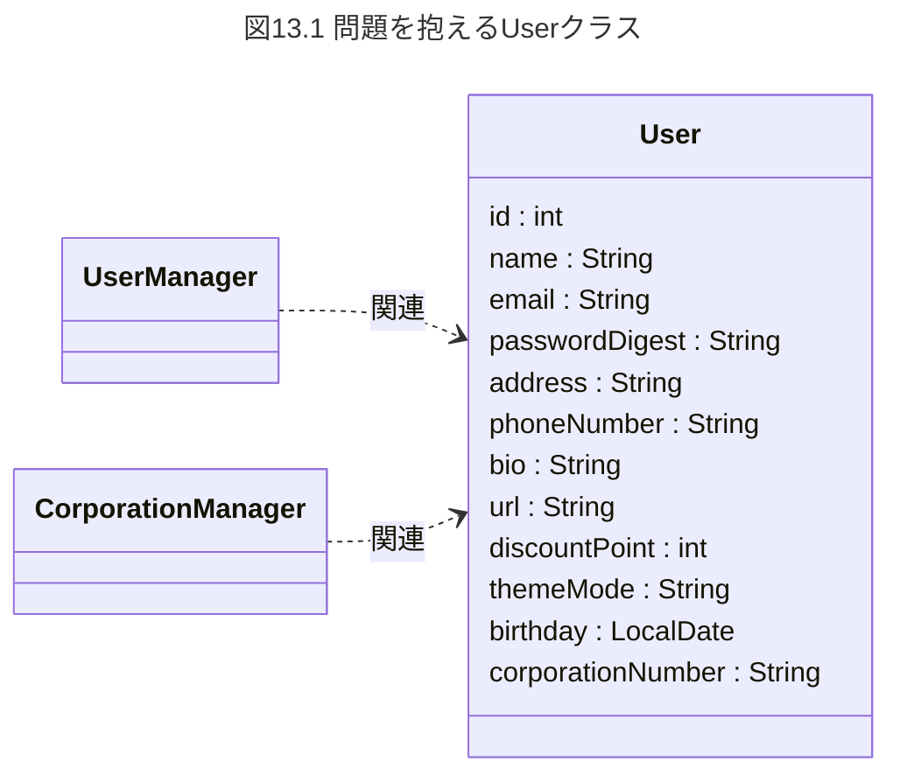

しかし、その後すぐ、様々なバグが発生し始めた。  
CorporationManager側でNullPointerExceptionが発生した。  
法人番号を示すUser.corporationNumberがnullだったのだ。  
原因を調べると、UserManager側で登録したUserを読み込んでしまっていた。  
UserManagerは買い手のユーザーを想定しており、法人番号の登録は不要だったためである。  

一方、UserManager側でもNullPointerExceptionが発生した。  
生年月日を示すUser.birthdayがnullだったからだ。  
CorporationManager側で登録したUserを読み込んでしまっており、法人ユーザーを想定しているCorporationManagerでは生年月日を登録していないのが原因であった。  

バグはそれだけではない。  
CorporationManager側でUser.nameのバリデーションエラーが発生した。  
CorporationManagerでは、名前は4文字以上のルールだが、UserManagerで登録されたUserを読み込んだ結果、そのUserの名前は3文字だったのだ。  
同様にUserManager側でもバリデーションエラーが発生した。  
CorporationManagerで登録されたUserを読み込み、その名前には、人名では使えない「㈱」が使われていたためだ。  

さらに、Userクラスの様々なインスタンス変数に関してNullPointerExceptionなどのエラーが起こるようになった。  
正常動作させるために、あちこちにnullチェック用の条件分岐を挿入したり、バグ回避用のロジックを追加したり、メンテナンスが難しいコードになってしまった。  

以上がUserクラスの弊害を描いた架空のシナリオとなる。  
現実のプロダクションコードでも同様の事例は多いのではなかろうか。  

なぜ、このような弊害が起こってしまったのか。  
結論から述べると、うまくモデリングされていないのが原因だからだ。  

---
---

## 13.2 モデリングの考え方とあるべき構造

モデルはシステム構造の説明のために用いる。  
したがって、モデリングの理解には、まずシステムが何であるかを理解しなければならない。  

---

### 13.2.1 システムとは何か

我々の世界は、様々な社会的活動によって成り立っている。  
目的地へ移動する、仕事をする、遊ぶ、買い物をする...といったものである。  
これらの活動は、それぞれのシステムにより実行される。  

辞書でシステムの定義を紐解くと、「きわめて多数の構成要素からなる集合体で、各部分が有機的に連携して、全体として一つの目的を持った仕事をするもの」とある。  
※新明解国語辞典 第七版 小型版 (2012) 三省堂より。  

例えば、目的地へ移動する時、人間は二本足を交互に動かすことで移動する、二足歩行システムを用いている。  
意思疎通では、話者が発声胃器官を使って話し、聞き手が鼓膜で音を拾う、音波を用いた会話システムを用いている。  
このように、人間はシステムを用いて社会的活動をしている。  
システムと聞くとコンピューター的なものを想像しがちであるが、肉体に備わる器官や臓器も立派なシステムである。  

され、人類は様々な道具や機械を発明してきた。  
目的地への移動に関しては、馬車、自動車、飛行機が発明されてきた。  
意思疎通に関しては、手紙、電話、SNS等があげられる。  
目的地への移動に関して、二足歩行の代わりに自動車や飛行機などの別のシステムを使える。  
つまり、社会的活動は、あるシステムから別のシステムへ代替可能なのだ。  

ところでなぜ自動車などのシステムが作り出されるのだろうか。  
二足歩行と比べて、自動車や飛行機を使うと何倍も速く目的地は移動できる。  
つまり、目的達成を効率化するためにシステムは作り出される。  
**システムは目的達成のための手段でしかない。**  
テクノロジーの本質は能力の拡大縮小である。  
システム内、コンピューターを利用したものを情報システムと呼ぶ。  

---

### 13.2.2 システム構造とモデリング

世の中にある便利なシステムは、特徴的な構造を備えている。  
モデルはシステム構造の説明に用いる。  

例えば、電気自動車は、蓄電するバッテリー、車軸を回転させるモーター、モーター回転速度の制御装置などから構成される。  

図13.3 電気自動車の構造  


システム構造を説明するために、単純な箱で図式化したものをモデルという。  
モデルの意図を定義し、構成を設計することをモデリングと呼ぶ。  

システムは目的達成手段である。  
そしてモデルはシステムの構成要素である。  
つまり、モデルは目的達成手段の一部である。  
**特定の目的達成のために最低限考慮が必要な要素を備えたものがモデル**である。  

---

### 13.2.3 ソフトウェア設計におけるモデリング

ソフトウェア設計でのモデルはどうでしょうか。  
ECサイトを題材に考えてみる。  

ECサイトは商品売買をシステム化したものである。  
ECサイトにより売買が効率化され、家にいながらも商品を入手できる恩恵を我々は得ている。  

ここで、商品はどういうモデルになるのだろうか。  
商品には様々な付帯要素(情報)がある。  
商品名、原価、売価、製造年月日、製造メーカー、構成部品、部品の素材、部品の製造業者、賞味期限、消費期限...、挙げようとすればいくらでもあげられる。  

これらすべてを盛り込むと、モデルの目的が分からなくなる。  
取り扱うデータが爆発的に増え、現実的ではない。  

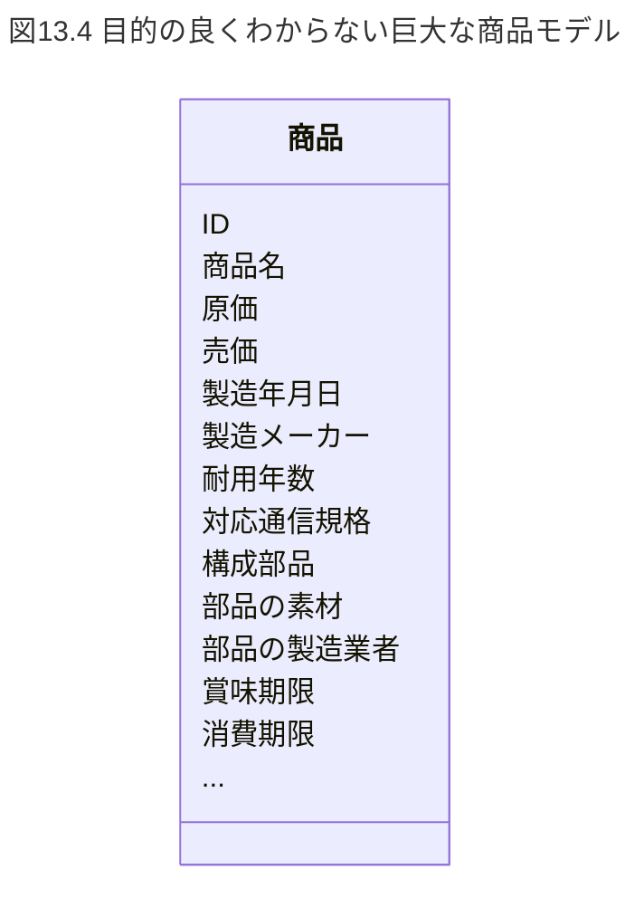

もでるは「特定の目的達成のために最低限考慮が必要な要素を備えたもの」と説明した。  
ということで、目的を絞ってみる。  

注文時に、商品モデルに最低限必須の要素を考える。  
商品ID、商品名、売価、在庫数が考えられる。  

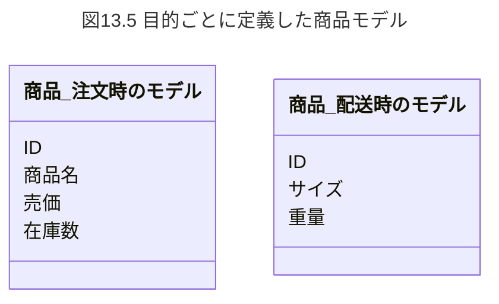

配送時はどうだろうか。  
配送では売価や在庫数は必要ない。  
一方、商品を梱包するために、商品のサイズや重量といった要素が必要になる。  

注文と配送では達成目的が違う。  
つまり、目的それぞれで商品モデルが違うのだ。  

---
---

## 13.3 良くないモデルの問題点と解決方法

モデリングの観点から、Userクラスの問題点を検証する。  
ここでは、Userクラスをモデルとして解釈する。  

モデルは「特定の目的達成のために最低限考慮が必要な要素を備えたもの」である。  
では、Userモデルの目的とは何だろうか。  

生年月日は個人のプロフィールに関連がある。  
それでは、法人番号は個人のプロフィール関連だろうか？違うよな？  
法人情報の検証に関連するものだ。  

メールやパスワードはどうだろうか。  
個人でも法人でもなく、ログイン認証に用いられるものだ。  
そのほか画面表示色など、それぞれ全く関連が異なる。  

つまり、Userクラス(モデル)は、**複数の目的のために無理矢理利用されており、モデリングしているようでモデリングしていない**といえる。  
このようなモデルを**一貫性がない**という言い方をする。  

多くのWebサービスではUserクラスが作られることが多い。  
しかし、様々な機能追加に伴い、利用者の付帯要素が次々にUserクラスに追加され、一貫性が失われていく。  
そして様々な弊害を招く。  

設計品質が問題になる現場では、ろくにモデリングされず、ただ動くだけのコードが書かれることが多いように見受けられる。  
正しくモデリングされないと、Userクラスのような弊害を招いてしまう。  
モデリングには、対象とする社会的活動や目的の理解が必須なのだ。  

---

### 13.3.1 Userとシステムの関係

Userクラス(モデル)はどうモデリングすればよかったのだろうか。  
Userとは何かというところから探りを入れる。  
Userは直訳すると利用者、使用者である。  
「利用者」は「何を」利用しているのだろうか？  
システムを利用しているのに他ならない。  
したがって、Userとは「システム利用者」であると考えられる。  

UMLには、システムのユースケースを記述するユースケース図がある。  
ユースケースが記述される四角がシステムであり、システム利用者はアクターとして記述される。  

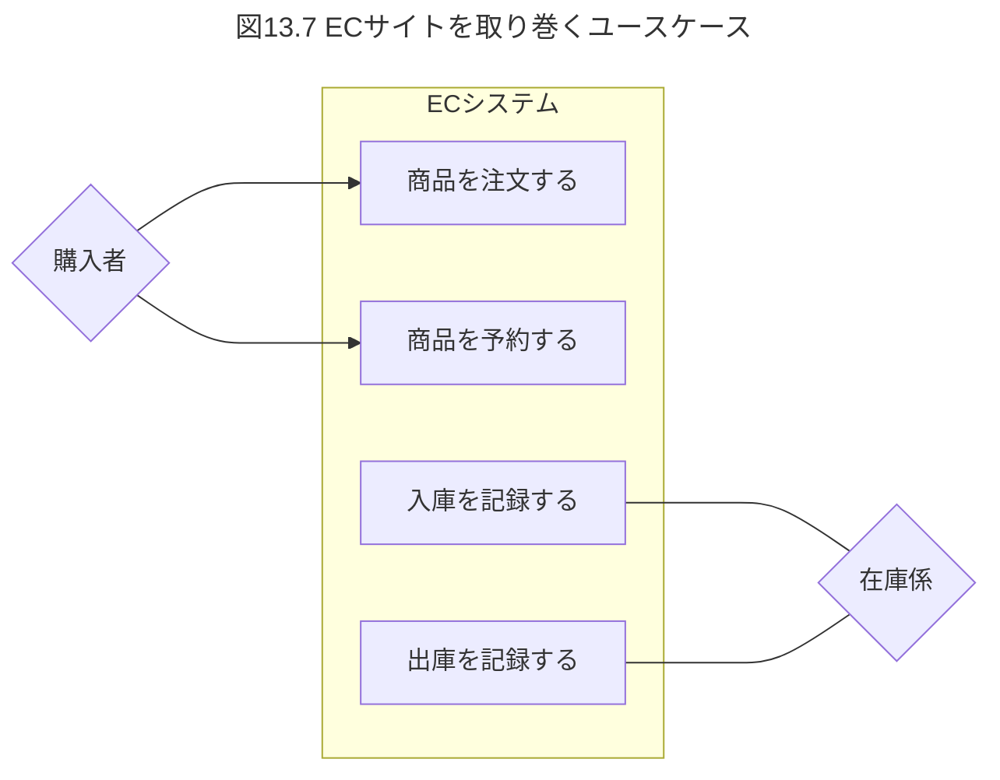

図13.7からもわかるように、アクターすなわちシステム利用者は、システムの外側にいる。  
システムの定義に立ち返ると、システムは社会的活動を効率化するために作り出され、利用されるものだ。  
そのシステムの中にUserとして組み入れられるのは、何か不自然な感じがする。  
よく考えると商品も物理的にはシステムの外にいる。  
しかし、一方で名前や生年月日、Eメール、そして売値や在庫数など利用者や商品の付帯要素は、システムを動作させる上で必要である。  
一見いびつなこの関係を解消しなければならない。  
そして解消の鍵は、情報システムが持つ、自動車や飛行機といった物理的なシステムとは大きく異なる特徴にある。  

---

### 13.3.2 仮想世界を表現する情報システム

情報システムのベースはコンピューターである。  
コンピューターは0と1のビットの世界である。  
ECサイトでの「注文する」「代金を支払う」といったアクションも、コンピューター上では01でしか表現されていない。  
そこには人間が物理的にお店に注文しに行ったり、紙幣や硬貨といった現金を物理的に渡したりしているのではなく、概念的な事柄のみが01のビットとして表現されているだけなのだ。  

つまり情報システムというのは、現実世界の概念のみをコンピューターの世界へ投影した仮想現実である、というところが、自動車や飛行機といった物理的システムと大きく異なる特徴になる。  
現実世界の概念をコンピューターの仮想世界へ変換し、意味を対応付け、そして概念的なやり取りをコンピューターによって高速化することで効率化していると考えることができる。  

---

### 13.3.3 目的別にモデリングする

この考えに基づくと、商品や利用者は物理的な詳細などは無視され、概念的な側面だけが仮想現実の世界に投影されたモデルとして解釈できる。  
ただ、利用者をそのままUserとしてモデリングしてしまうと、モデルの一貫性の問題が解決できない。  

これを解決する良いヒントがある。  
就職活動では、履歴書や職務経歴書、推薦状を使う。  
これらは就活者個人の性質を表現した媒体である。  
各媒体は目的ごとに表現方法や名前が異なる。  
統一的に「User」などという名前では表されていない。  
つまり、利用者を表現する手段は、目的に応じて名前や形態が違ってくるのだ。  
たった一つではないのだ。  

モデルは「特定の目的達成のために最低限考慮が必要な要素を備えたもの」と説明した。  
では、利用者に関して、目的に応じたモデルと考えてみよう。  

図13.8 GitHubのユーザー設定項目  
  

図13.8はGitHubのユーザー設定画面である。  
目的ごとに設定項目が分かれている。  
ログイン認証の解決には「アカウント」、生年月日や自己紹介といった個人のパーソナリティの解決には「プロフィール」といったモデルとして表現可能であることが分かる。  
個人としての利用方法と法人としてのそれは違うため、アカウントをさらに「個人アカウント」「法人アカウント」とわけてモデルを表現することでモデルの一貫性の問題を解決できる。  

**このように情報システムでは、現実世界での物理的な存在と、情報システム上のモデルが1:1になるとは限らず、1:多の関係になるケースがあることが大きな特徴**である。  
これが、品質設計を考える上で特に注意しなければならないところである。  

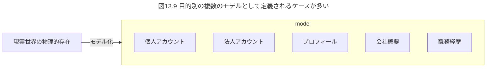

また、もう一つの観点として、User(利用者)という名前があいまいな点がある。  
個人ユーザーとも法人ユーザーとも、どうとでも解釈可能で、大雑把でガバガバすぎる名前になっている。  
目的駆動名前設計(10章)のように、具体的で意味の狭く、目的を表現した名前へ設計し直すことも重要である。  

目的ベースで名前を設計し直すと、例えば次のようになる。  

|目的|目的ベースの名前|
|---|---|
|個人認証|PersonalAccount|
|法人認証|CorporateAccount|
|特徴の表現|Profile|

補足だが、本章の冒頭で登場したUserManagerも意味が広すぎてガバガバである。  
たとえば個人認証に対応するPersonalAccountAuthenticationクラスや、プロフィール更新に対応するUpdateProfileUseCaseクラスなど、目的ごとのクラスに分解するのがよいだろう。  

---

### 13.3.4 モデルはモノではなく目的達成手段

そもそもモデリングがうまくいかないのは、モデルを単なるモノとして解釈していることが原因の一端ではないだろうか。  
ユーザーであれ商品であれ、モノとして解釈するとあらゆる目的で使われ、様々なデータが詰め込まれて巨大化し、一貫性のない構造になってしまう。  

モデルは、目的達成手段であるシステムの一部である。  
目的達成手段と解釈することでうまくモデリングできる。  

利用者のモデリングで考えると、PersonalAccountは個人認証手段であり、Profileは特徴表現手段である。  
この目的達成手段としてのモデルと10章で紹介した目的駆動命名設計はリンクした考え方である。  
**目的駆動で名前設計することが、適切に目的達成するモデルを設計することにつながる。**  

---

### 13.3.5 単一責任とは単一目的

そして、このモデルと目的の関係は8.1.3で解説した単一責任原則にもつながる。  

Userクラスは、複数の目的で使いまわされていたために問題が生じていた。  
リスト8.1のDiscountManager.getDiscountPriceは通常割引価格と夏季割引価格の2つの目的で使いまわされており、二重に責任を負わされている。  

この例で示したように、目的と責任は対になっていると言える。  
つまり単一責任原則とは、**単一目的の原則**であると著者考えている。  
「クラスが果たす目的は、たった一つに限定すべき」だと考える。  

クラスというと「共通利用可能な、汎用的な部品として設計するもの」と考えている人がいるかもしれない。  
しかし、そうではない。逆である。  
**特定の目的に特化して設計することで、変更に強い高品質な構造になる。**  

設計に理解ある開発現場では、「責務を考えて設計して」といったセリフが良く飛び交います。(へーって感じ。)  
しかし、「責務、責務」といわれても、いまいちピンとこないことがあるかもしれない。  

そんな時は、まず目的を見直す。  
**なぜなら、システムは何らかの目的を達成するために作られるのであり、責務よりも目的が先に来る**からである。  

---

### 13.3.6 モデルの見直し方

クラスの構造に問題がある場合、モデルに問題がある。  
モデルにいびつさ、不自然さがあり、一貫性がない場合は、以下を検討してみよう。  

- そのモデルが達成しようとしている目的をすべて洗い出す。  
- 目的それぞれ特化したモデリングをし直す。  
- 目的駆動名前設計に基づき、モデルに命名する。  
- モデルに目的外の要素が入り込んでいる場合、さらに見直す。  

---

### 13.3.7 モデルと実装は必ず相互にフィードバックする

モデルは仕組みを単純化したものに過ぎない。  
細部は描写されない。  
したがって、モデルに基づきクラスを設計し、コードを実装していく。  

モデル=クラスは必ずしも成り立たない。  
モデルは1個または複数のクラスから構成されるものと考えてくれ。  

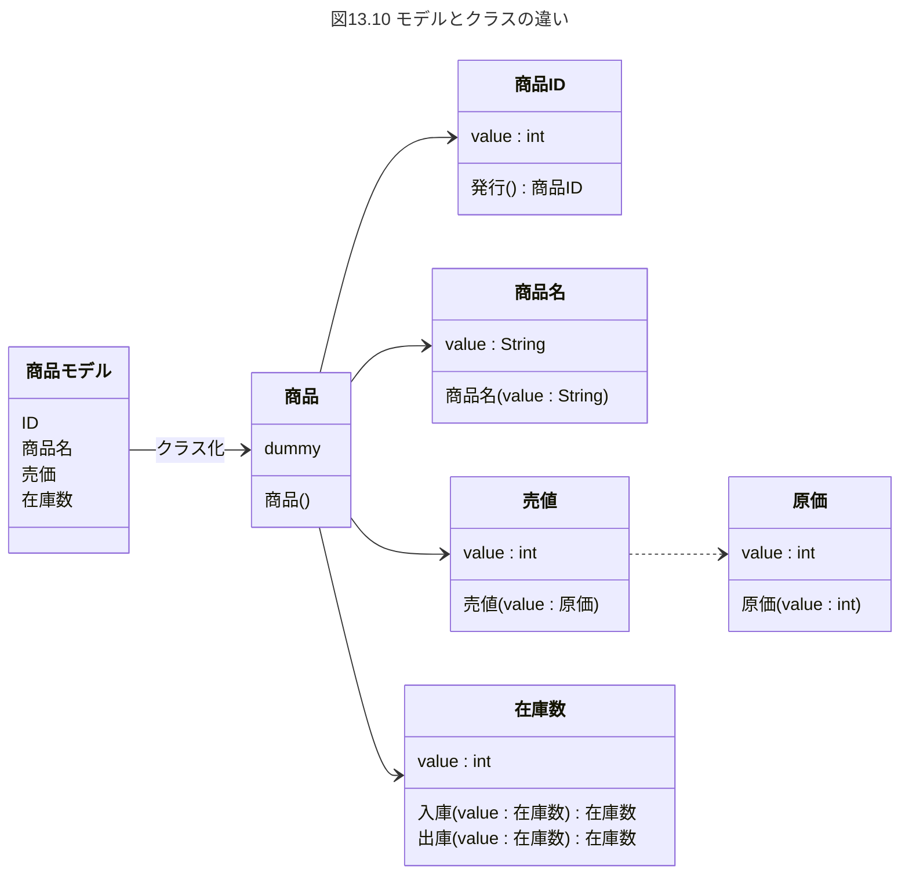

クラスやコードに精緻化していく段階で、動作上の必須要素の見落としに気付くことがよくある。  
クラス設計や実装で気づいたことは必ずモデルにフィードバックしよう。  
フィードバックすることで、モデルの正確性が向上する。  
それによって、さらに良いモデルへ構造を革新できる場合もある。  
革新したモデルに基づき、クラスそしてコードの品質が向上する。  

フィードバックしないとモデルの構造とソースコードが乖離していき、せっかくモデリングしたものが役立たなくなってしまう。  
改善革新のサイクルを回せなくなってしまう。  

フィードバックのサイクルを回し続けることが設計品質向上の秘訣となる。  

---

### コラム クソコード動画「User」クラス

クソコード動画「Userクラス」は、本章で取り上げたUserクラスの弊害をそのまま描いた作品となる。  
次のような、本章の冒頭で上げたUserクラスの弊害がそのまま動画化されている。  

- 法人番号にnullを渡して法人管理クラス側でNullPointerException例外が発生する。  
- 人名に使えない文字「㈱」を渡して顧客管理クラス側でバリデーションエラーになる。  

終盤、彼らはUserクラスの分割を試みるのだが、他の様々なクラスがUserクラスに依存している構造で、分割しようにも影響が全体に及んでしまう。  
結局、分割に失敗し、誰もが幸せになれない結末となってしまう。  

Webサービスでは、ほとんどのユースケースでユーザー認証が必要など、利用者関連の何かが顔をのぞかせるケースが多く、依存度は高い傾向にある。  
動画にあるように、依存の個数が多いほど影響範囲が広く、変更やメンテナンスが大変になる。  

こうならないためにも、序盤のモデリングは大事な設計になる。  
開発当初はシステム化対象の概念理解が浅いために、制度としてはいまいちなモデルになってしまうかもしれない。  
だからと言って、モデリングを疎かにして良いというわけではない。  

開発が進んでいくと、雑な構造であってもどんどん依存が高まっていく。  
こうなると、後からモデリングし直そう、構造を整理しようと思っても、あまりの依存の多さに尻込みしてしまいがちになる。  

将来、こうしたツケで苦しまないためにも、開発序盤はしっかり目的特化でモデリングしよう。  

<https://twitter.com/MinoDriven/status/1380773721032433674>

---
---

## 13.4 機能性を左右するモデリング

機能性とはソフトウェア品質特性の一つで、顧客のニーズを満たす度合いを言う。(15.1)  
機能性とモデリングについて解説する。  

---

### 13.4.1 裏に隠れた真の目的を見破る

ECサイトにおける商品購入のモデリングを考えてみる。  
構成要素として購入対象の商品や価格などを盛り込むと、図13.13のようなモデルになるかもしれない。  

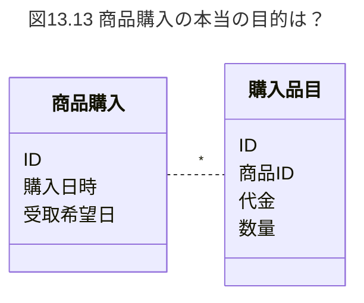

しかし、このモデルでは機能性を発揮できない可能性がある。  
それは、商品購入の裏に隠れた、真の姿に秘密がある。  

多くのECサイトの利用規約では、「利用者の商品購入操作をもって売買契約を締結するものとする」と定義づけている。  
商品購入とは、実は法的には売買契約となる。  
法的な顔をのぞかせると、全く重みが違ってくる。  
モデリング上考慮しなければならない構成要素が変わってくる。  

売買契約では、市はi時期や決済方法といった、支払い条件を指定する必要がある。  
図13.13のモデルでは、支払い条件に該当する要素が含まれていない。  
法的な側面がシステム化されていないとどうなるだろう。  
売り手と買い手に何らかのトラブルが発生した際、法的な有効性を発揮できず、トラブルをうまく解決できないシステムになってしまう可能性がある。  
機能性が損失してしまうのだ。  

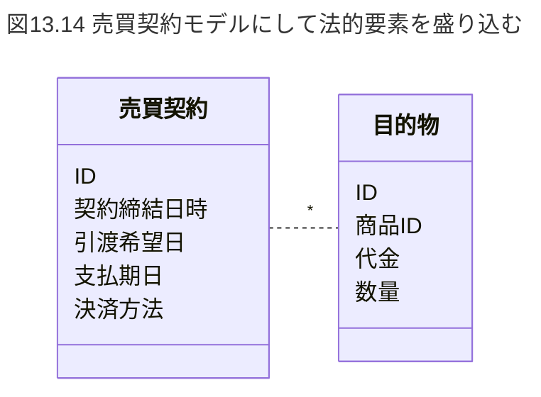

機能性をうまく発揮するためには、概念の正体や、裏に隠れた重大な目的を見破る必要がある。  

---

### 13.4.2 機能性をイノベートする「深いモデル」

サバとサンマ。  
この2つのモデルがあった場合、どう抽象化するだろうか。  
何か観点がないと、図13.15のように魚類として抽象化するかもしれない。  

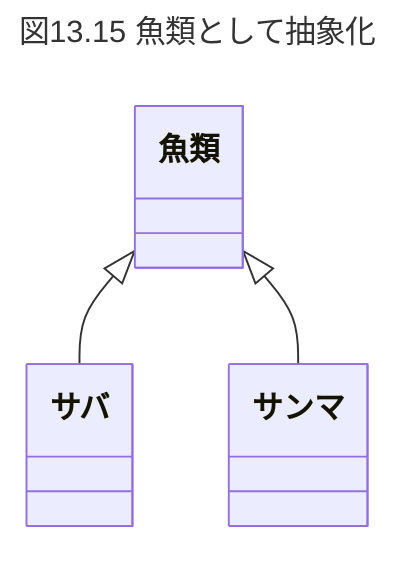

ここで豚が追加されたらどうなるだろうか。  
生物学的な分類として図13.16のようになるかもしれない。  

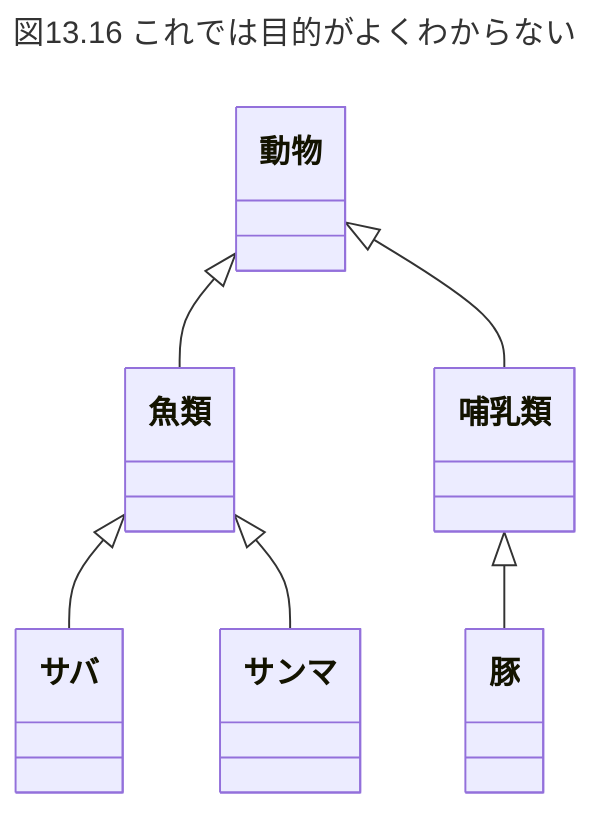

しかし、このような抽象化では、各モデルがどういった役割を果たすのかがよくわからない。  
モデルは目的達成手段であると説明した。  
これらのモデルを、何らかの達成手段として考えてみる。  
例えば先に挙げたサバ、サンマ、豚を「栄養摂取手段」として抽象化する、下記のようになる。  

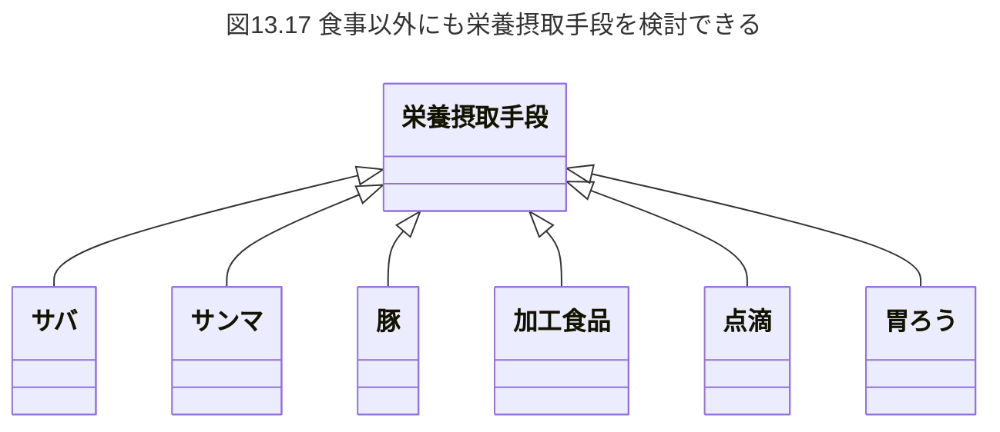

栄養摂取できれば良いのだから、豚以外にも野菜や加工食品であっても良いわけである。  
さらに食事以外の手段も考えることができる。  
例えば、点滴や胃ろうでも良くなる。  
このように目的達成手段として解釈し、抽象化すると、モデルに発展性が生まれる。  

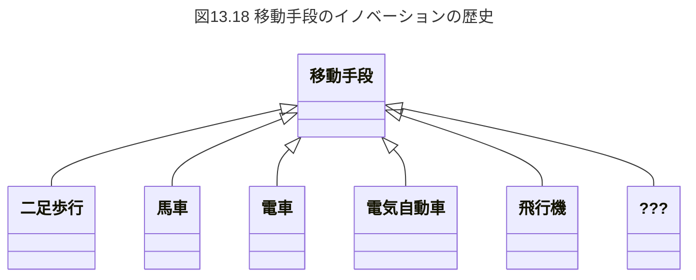

図13.18に示す二足歩行や馬車は、移動手段を具体化したものになる。  
他には自動車や飛行機がある。  
ところで電車も自動車も飛行機も、それぞれ全く構造が違う。

同じ目的達成手段でも、構造によって達成効率が異なる。  
つまり、新たな構造、仕組みによって、機能性をイノベートできることを示唆している。  

次世代の移動手段はどんな仕組みになるだろうか。  
乗り物とは限らないし、もしかしたら瞬間移動装置かもしれない。  

ソフトウェアでもこれまで様々なイノベーションがあった。  
例えば、興味深い話題をインターネットで教え広めたいケース。  
情報拡散手段として古くは掲示板やEメール、個人ブログが主流だった。  
しかし、Twitterの登場によりいっぺんする。  

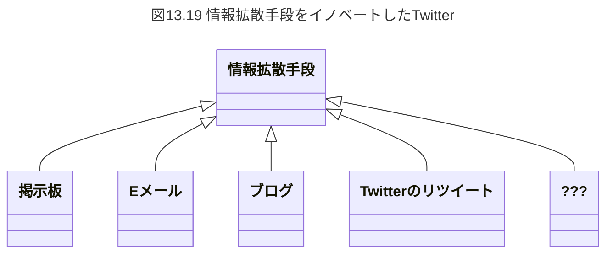

Twitterは、リツイートされたツイートがフォロワーのタイムラインに表示される仕組みを採用している。  
この仕組みにより、良くも悪くも話題性のあるツイートが爆発的に拡散される。  
情報拡散する機能性において、旧来のメッセージングとは一線を画す。  

リツイートを情報拡散手段のモデルとして解釈すると、リツイートはフォロワーのタイムラインを変換する能力を備えていると考えられる。  
世の中の優れた仕組みは、優れた変換能力を有している。  
モニターは映像ケーブルからビット信号を受け取って画素へ変換し、色鮮やかな画像を表示する。  
それによって我々は家にいながら商品を購入し、受け取りを可能にしている。  

コンピューターの本質は0と1の信号変換、および信号変換を応用した演算である。  
優れた変換能力を備えるようモデルを設計することが、機能性の革新に貢献するモデルを、ドメイン駆動設計(17.1.11)では**深いモデル**と呼ぶ。  

深いモデルは一朝一夕に得られるものでは無い。  
試行錯誤を積み重ね、モデルの改良を繰り返していくことで発想が転換し、大きなブレークスルーを伴って深いモデルを獲得できるものとされている。  
設計は一度やったら終わりではなく、日々繰り返し改良していくことが重要である。  
