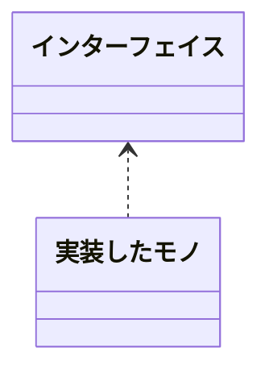
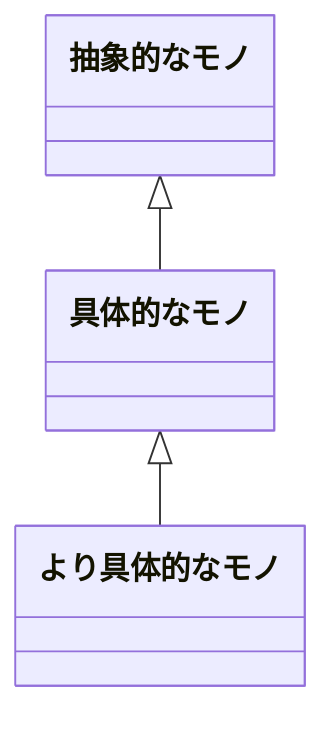
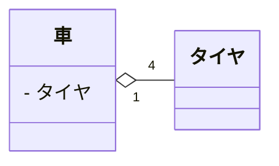
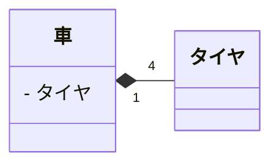
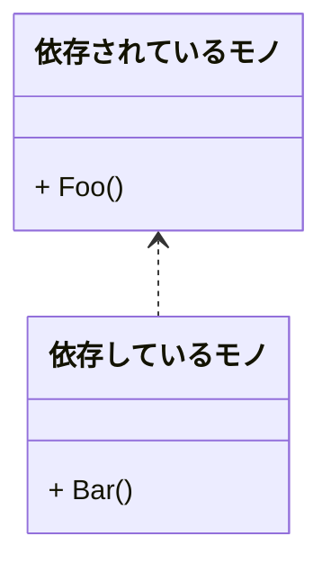
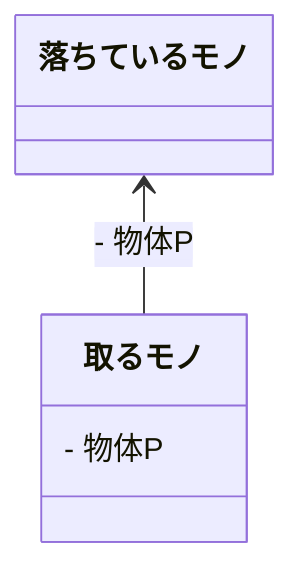

# クラス図

## クラス図の書き方（記号・多重度）

|線形|関連|説明|
|:--|:--|:--|
||実現(realization)|クラス間のインターフェースを表現|
||汎化(generalization)|クラス間の継承を表現|
||集約(aggregation)|クラス間の関連で全体と一部という関係性を表現|
||合成(composition)|集約よりも強い集約|
||依存(dependency)|クラス間の依存関係を表現|
||関連(association)|クラス間の関連を表現|

[【UML】クラス図とは | クラス図の書き方と記号](https://medium-company.com/%E3%82%AF%E3%83%A9%E3%82%B9%E5%9B%B3/#composition)  

---

## 実現(realization)

インターフェース実装(implemente)の事  



``` cs
public interface インターフェイス{
    // ...
}

public class 実装したモノ : インターフェイス{
    //...
}
```

---

## 汎化(generalization)

継承(inheritance)の事  
厳密ではないがis-a関係と呼ばれるもの。  



``` cs
public class 抽象的なモノ{
    // ...
}

public class 具体的なモノ : 抽象的なモノ {
    // ...
}

public class より具体的なモノ : 具体的なモノ {
    // ...
}
```

---

## 集約(aggregation)

>集約は関連のサブセットで"part-of"の関係を表し、部分（ClassF）が複数の全体（ClassE）に共有されます。  
つまり、オブジェクトの生存期間が一致しません。  
関連と実装上の違いはないですが意味的に「全体と部分」の関係を示したものが集約と考えれます。  
<https://zenn.dev/tak_uchida/articles/da583cf960e854>

has-a関係に属するもの。  

>複数の「全体」インスタンスが、1つの「部分」インスタンスを共有する。  
コンポジションより結びつきが緩やか。  
所持する側が破棄されても所持される側までは破棄されないような関係。  
<https://crieit.net/posts/UML#%E9%96%A2%E9%80%A3>

つまるところ、「全体クラスが部分クラスをメンバ変数として保持し、全体クラスの内部で部分クラスをnewしない状態のこと。部分クラスを外部から注入して全体側で保持する状態のこと」で良いかと思われる。  

メンバ変数を newすれば 合成(composition)  
メンバ変数を newしなければ 集約(aggregation)  

例:  
「タイヤクラス」は「車クラス」の一部であるが、車を破棄する時はタイヤを取り外してから破棄するので、タイヤは再利用可能といった関係性。  
クラス間の多重度は1対4。  



白抜き菱形は持っている側に付く。  
白抜きは、全体と部分としての結びつきが緩い。  

``` cs
// 全体側
class Car
{
    // 集約
    private List<Tire> _Tires;

    // 車をnewする時に外部から注入してもらう
    public Car(List<Tire> tires)
    {
        _Tires = tires;
    }
}

// 部分側
class Tire
{
    // ...
}
```

---

## 合成(composition)

>合成は関連のサブセットで"part-of"の関係を表し、部分（ClassJ）が唯一の全体（ClassI）に共有されます。  
つまり、オブジェクトの生存期間が一致します。  
「全体クラス」が削除されると「部分クラス」もあわせて削除されるような関係性。  
<https://zenn.dev/tak_uchida/articles/da583cf960e854>  

has-a関係に属するもの。  

つまるところ、「全体クラスが部分クラスをメンバ変数として保持し、全体クラスの内部で部分クラスをnewする状態のこと。若しくは全体側をDisposeした際、部分インスタンスもDisposeする関係のこと。若しくは内部クラスを実装した全体クラス」で良いかと思われる。  

メンバ変数を newすれば 合成(composition)  
メンバ変数を newしなければ 集約(aggregation)  

例:  
「タイヤクラス」は「車クラス」の一部であり、「廃車になれば、車についていたタイヤも破棄される」といった関係性。  
クラス間の多重度は1対4。  



黒塗り菱形は持っている側に付く。  
黒塗りは、全体と部分としての結びつきが強い。  

``` cs
// 全体側
class Car : IDisposable
{
    // 合成
    private Tire[] _Tires;

    // 車をnewする時にタイヤもnewする。
    // 車が破棄された時、タイヤの参照も切れるのでいずれGCされる。
    // つまり車が破棄されたと同時にタイヤも破棄されるのと同義となる。
    public Car(List<Tire> tires)
    {
        _Tires = new Tite[4];
    }
}

// 部分側
class Tire
{
    // ...
}
```

or  

``` cs
class Car : IDisposable
{
    // コンポジション
    private Tire[] _Tires;

    // 車をnewする時に外部から注入してもらう
    // しかしDisposeと同時にタイヤもDisposeされるので全体が死んだら部分も死ぬ強い関係性となる。
    public Car(Tire[] tires)
    {
        _Tires = tires;
    }

    public void Dispose()
    {
        Dispose(true);
        GC.SuppressFinalize(this);
    }

    // 車を破棄すると同時にタイヤも破棄する
    protected virtual void Dispose(bool disposing)
    {
        if (disposing)
        {
            foreach(Tire tire in _Tires)
            {
                tire.Dispose();
            }
            _Tires = null;
        }
    }

    ~Hoge()
    {
        Dispose(false);
    }
}

class Tire : IDisposable
{
    // Disposeなど、削除に必要なものを実装
}
```

or

``` cs
class 全体クラス 
{
    class 内部クラス {
        //...
    }
}
```

---

## 依存(dependency)

片方の変更がもう片方のクラスの動作に影響を与える関係。  

>>依存は、とあるクラス（ここでは要素ではなくクラスと読んで差し支えない）の仕様や実装のために、別のクラスを必要としていることを意味する。  
>実装に必要であればいいようです。  
[実践UML記述法：UMLのクラス図における関係の考察](https://crieit.net/posts/UML)  

とはいっても、大抵の場合そうなるはずなので、「メンバ変数として保持せず、メソッド単位でそのクラスを利用する関係」程度でいいのかもしれない。  

「メソッドの中でしか生きられないが、そのクラスを実装するに当たって必要なのでnewして使っている」とかそんな程度かな。  



``` cs
class 依存されているモノ 
{
    void Foo()
    {
        Console.WriteLine('foo');
    } 
}

class 依存しているモノ 
{
    public void Bar(依存されているモノ s) 
    {
        s.Foo();
    }
}
```

or メソッドの中で直接newして使用する。  

``` cs
class 依存されているモノ 
{
    void Foo()
    {
        Console.WriteLine('foo');
    } 
}

class 依存しているモノ 
{
    public void Bar() 
    {
        var 依存されているモノ = new 依存されているモノ();
        依存されているモノ.Foo();
    }
}
```

---

## 関連(association)

has-a関係と呼ばれたり呼ばれなかったりする関係  
この関係が一番微妙らしく、サイトによって定義がマチマチ過ぎる。  

実現、汎化、コンポジション、集約、依存のいずれにもあたらないが、依存より強い関係を持つ状態  

>アソシエーションは、オブジェクトがお互いを「知っている」ことを意味するだけです。  
>例えば、母親とその子供。  
>
>``` cs
>class Child {}
>
>class Mother {
>    List<Child> children;
>}
>```
>
>or
>
>``` cs
>class Child {
>    Mother mother;
>}
>
>class Mother {
>    List<Child> children;
>}
>```
>
>しかし、ちょっと待ってください。  
>リファレンスが集約を意味するのか、関連を意味するのか、どうやって見分ければいいのでしょうか。  
>そうですね、それはできません。  
>違いは論理的なものだけです。  
>オブジェクトの一方が他方の一部であるか、そうでないかです。  
>[Composition, Aggregation, and Association in Java](https://www.baeldung.com/java-composition-aggregation-association)  

Enumとかをメンバ変数として保持してするとかそういう感じだろうか。  
集約はそのクラスの機能の一部を部品クラスとして分離した状態を表すとしたら、こちらはメンバ変数に持ちはするが、そういう部品の関係ではなく、ただ関連があるだけ、若しくは機能を実装するに当たって別のクラスの機能をちょっと使わせてもらうとかそういう認識だろうか。  

[このサイト](https://crieit.net/posts/UML#%E9%96%A2%E9%80%A3)の例では以下の用なクラス図と実装がそれに当たると言っているが、[ここ](https://zenn.dev/tak_uchida/articles/da583cf960e854)と[ここ](https://www.baeldung.com/java-composition-aggregation-association)ではクラスを辿れるだとか、論理的な意味合いでしかないといっている。  
つまり、みんなわかっていないので、関連なんて使わないほうがいいのかもしれない。  



``` cs
class 落ちているもの 
{
    // ...
}

class 取るもの 
{
    void hoge() 
    {
        落ちているもの 物体P = new 落ちているもの();
    }
}
```

---

## 「関連」と「依存」の違い

関連：メンバ変数に（オブジェクトを）持つ  
依存：一時オブジェクトとしてnewする関係  

「依存先のオブジェクトをメンバ変数として持つのか（関連），メソッドでnewするのか（依存）で使い分ける」  

[【UML】 クラス図における「関連」と「依存」の違い【開発・ドキュメント】](https://kashikoku.instafr.com/entry/uml-kanren-izon)  

---

## 「集約」と「コンポジション」の違い

「ひし形」自体が「全体と部分」を表現している。  
白抜きも黒塗りも、ともに「全体と部分」＝「part-of」。  
白抜きは、全体と部分としての結びつきが緩やかで、黒塗りは、全体と部分としての結びつきが強い。  

[【コードで分かるUMLシリーズ】クラス図の書きかた(集約とコンポジションの意味の違い)](https://qiita.com/azuki8/items/49e1add6ea838cd13734)  

>●メンバ変数を newすれば コンポジット  
>●メンバ変数を newしなければ 集約  
>コンポジットと集約の違い、使い分けのキモは、たったこれだけのことである。  
[クラス図の「集約」と「コンポジション」の使い分け方](http://mylifeinventory.blog.fc2.com/blog-entry-27.html)  

---

てか、集約だとかコンポジションだとか言ってるが、内部でnewしてたら基本的に依存してることになるよな？

「メソッドの中でnewしてるから集約です。メソッドが終わったら終了です。」  
とは言ってるけど、クラス内部のメソッドでnewしてるあたりそのクラスに依存していることになるんだよな。  

コンポジションはクラス変数としてもっておいて、外部から注入なり、セッターなりで入れたとしても、

newしてるとか外部から注入とか余り関係ないのか？

なんというか、ほとんど継承と実装と依存で住むような気がするが？
クラス変数として保持していれば集約扱いになる？
外部から注入してもらう分には集約・保持でいいけど、内部でnewした瞬間、依存という関係になるのでは？

こういう点を解説しているサイトがない当たり、結局誰もわかっていないのでは？UMLも形骸化しているのでは？
依存だの、集約だの、コンポジションだのご高説を垂れるのはいいけど、ならコード例を示してくれって思う。
それもなしに解説するな。

visual studio のクラス図生成機能を使ったらどうなるだろうか。  
帳票印刷のデータクラスみたいにpocoだけなら集約になるのだろうか。  
→  
対して使えなかった。  
単純な関連しか表す事が出来なかった。  

クラス内部で別のクラスをnewしているだけで依存している状態なのは変わらない。  
それに意味をつけるかどうかの違いでしかないのか。  

外部からの注入でクラス変数として保持するなら集約。  
クラス変数として保持して内部でnewしているなら合成。
メソッド単位で注入するなら依存 or 委譲？

コンポジションの例として、車とタイヤの関係をよく目にするが、タイヤはまだ使えそうなので、タイヤだけを取り外して、車だけを破棄するってこともできるわけで、そうなるとコンポジションって使う場面そんなにないような気がするんだよなぁ。  
システムとユーザーがあって、システムが死んだらユーザーの情報もデリートってこともないはず。  

あるとしたらデータベースへの接続とそのサービスを使う中間層があったとして、中間層が破棄されたら自動的にデータベースへの接続情報も削除するとかそんな感じだろうか。  

集約、依存、関連あたりの定義が曖昧過ぎる。  
継承と実装はわかるとしてそれ以外は普通に関連がある程度でとらえたほうがいいのではなかろうか。  

---

[IT専科](https://www.itsenka.com/contents/development/uml/class.html)  
[実践UML記述法：UMLのクラス図における関係の考察](https://crieit.net/posts/UML)  
[【UML】クラス図とは | クラス図の書き方と記号](https://medium-company.com/%E3%82%AF%E3%83%A9%E3%82%B9%E5%9B%B3/)  
[やはりお前らのコンポジションは間違っている](https://qiita.com/turanukimaru/items/0b1396393908b7e22618)  
[【コードで分かるUMLシリーズ】クラス図の書きかた(集約とコンポジションの意味の違い)](https://qiita.com/azuki8/items/49e1add6ea838cd13734)

[継承よりもコンポジションを選ぶのとデザインパターンの話](https://volkruss.com/posts/p1460/)  
[クラスの「継承」より「合成」がよい理由とは？ゲーム開発におけるコードのフレキシビリティと可読性の向上](https://postd.cc/why-composition-is-often-better-than-inheritance/)  
[「継承より合成(移譲)」について](https://tyfkda.github.io/blog/2020/09/27/composition-over-inheritance.html)  

[Composition, Aggregation, and Association in Java](https://www.baeldung.com/java-composition-aggregation-association)  
